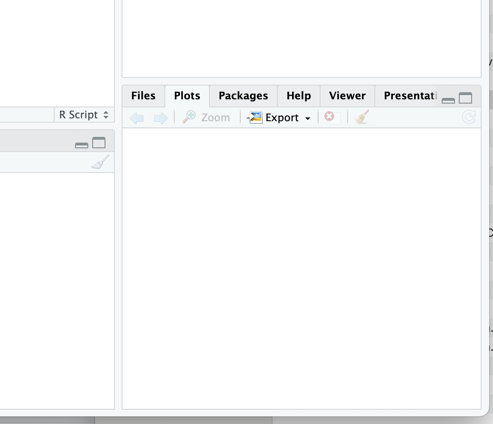

# Welcome to R

R is an open source statistical software package commonly used by researchers and other folks, who crave a free way to manipulate, analyze, and visualize data. R uses its own programming language, which is similar to S+ (the paid precursor to R). R employs an object-oriented programming (OOP) paradigm to manage and manipulate data. Object-oriented programming (OOP) is a paradigm where data and functions are grouped into ‘objects’ that can be reused, helping organize and simplify code.

Today, R is essential for ecological work that involves data analysis, whether you are participating in a graduate program and analyzing data for your thesis or working at a non-profit analyzing the efficacy of restoration treatments. We are using R in this lab to introduce you to the basics of data analysis. Managing, manipulating and analyzing data are important skills to include on your resume and will hopefully help you in other classes at NAU. Let's walk through the basics of installing and using R!

## R and R studio installation

You will first want to download R statistical software and R studio, which is a powerful program that interfaces with R to make your coding experience more organized and enjoyable. Notice that you need to select a version of R depending on your operating system.

## Download the R statistical software from the official R Project website. 

Open your web browser and go to the official R Project website at https://www.r-project.org/.

Choose a CRAN Mirror: On the R Project website's main page, you'll see a section that says "Download and Install R." Click on the link that says "CRAN (Comprehensive R Archive Network)." This will take you to the CRAN website.

1. Select Your Mirror: On the CRAN website, you'll find a list of mirrors (servers) from which you can download R. Choose a mirror that is geographically close to your location, as this will generally provide faster download speeds. Click on the mirror's link.

2. Download R for Your Operating System: On the mirror's page, you'll see options to download R for various operating systems (e.g., Windows, macOS, Linux). Click on the appropriate link for your operating system.

3. Choose the Latest Version: You'll typically see multiple versions of R available for download. It's recommended to choose the latest stable version unless you have a specific reason to use an older version.

4. Download and Install: After clicking on the download link, the installation file for R will begin downloading. Once the download is complete, run the installer and follow the installation instructions for your operating system.

5. Start Using R: After the installation is complete, you can launch R from your computer. First, let's install RStudio, a popular integrated development environment (IDE) for R, to enhance your R programming experience.

## Download R studio

Now download R studio!

1. Visit the RStudio Website: Open your web browser and go to the official RStudio website at https://www.rstudio.com/.

2. Download RStudio: On the RStudio website's main page, click on the "Products" menu at the top, and then select "RStudio" from the dropdown menu.

3. Choose the RStudio Edition: RStudio offers different editions, including RStudio Desktop (for use on your local machine), RStudio Server (for remote access), and RStudio Workbench (formerly known as RStudio Server Pro, designed for collaboration and sharing in enterprise environments). You will want to choose the free version, RStudio Desktop.

4. Download the Installer: After selecting the edition, you'll be directed to a page with download options. Click on the download link for your operating system (e.g., Windows, macOS, Linux).

5. Download and Install: The installation file for RStudio will begin downloading. Once the download is complete, run the installer and follow the installation instructions for your operating system.

Start Using RStudio: After the installation is complete, you can launch RStudio from your computer. 

## Optional: Set up R studio

Alright, now that you've downloaded R and R studio, open R studio. You can customize the panes that you are visualizing in R. 

In RStudio, the four panels or panes are commonly referred to as:

**Source Pane**: This is where you can write, edit, and save your R scripts and code files. It is typically used for script development and editing. You can open and create new R script files in this pane.

**Console Pane**: The console is where you interact with R directly. You can execute R commands and see their output here. It's an interactive environment where you can test and run R code line by line or in batches.

**Environment Pane**: The environment pane displays information about the objects, data frames, variables, and functions currently loaded in your R session. You can also use this pane to view data frames in a spreadsheet-like format and manage your workspace.

**Files/Plots/Packages/Help Pane**: This pane has multiple tabs and serves various purposes:
*Files*: It shows the file system of your project, allowing you to navigate and manage files and directories.
*Plots*: When you create plots in R, they will appear in this tab. You can interact with and export the plots from here.
*Packages*: This tab displays information about installed packages, and you can use it to install, update, or load packages.
*Help*: When you need documentation or help for R functions or packages, you can use the Help tab to search for and view documentation.

Typically, I select a structure in which I have my **Source pane** in the upper left, my **Console Pane** in the lower left position, my **Environment Pane** in the upper right corner, and the **Files/Plots/Packages/Help Pane** in the lower right position. You can select any position that you'd like, but if we create the same work environment, it will be easy for me to direct you when we are trouble-shooting code. To adjust the panels positions, use the pane layout function. Here's what that looks at for a Mac, but typically this arrangement is the default positioning for panels in R studio, so you likely won't have to adjust positioning!

{width=5%, height=auto}

## Downloads

Here is a nice example of a R script: [Download the R file](https://drive.google.com/uc?export=download&id=1JKAzcU--tpLG3bSXXNwF8NO3PI5x_jkW) Download and use the R script to practice with R.

Also, download this .csv file [Download the data file](https://drive.google.com/uc?export=download&id=1NejYe6LMu3qwSyKp3lz3ZvFF9c--FFzp) We will use it to practice importing a file.

## Using R

1. Create a folder on your desktop called: EcologyLab 
2. Download the R file and .csv file above
3. Once you've downloaded the R script, open it in R studio:

    - File -> Open file

4. You will see several things:

    - Text with a hastag in front of it (#This code ...). R won't run code with a hastag, so we can use this to explain what chunks of code do
    - Code to load and install packages.
    - Code to set your working directory 
    - Code in import data
    - Code to export data
    
We will go through each of these codes during this laboratory exercise.

### Packages and libraries

Base R, the fundamental, built-in set of functions, data structures, and libraries that come with the R programming language without the need for additional packages or extensions, including basic math functions, statistical analyses and visualization tools. However, one amazingly cool think about R is that folks are out there creating 'libraries', or a collection of R functions, data sets, and documentation bundled together into a single package, to do specialized analyses. For most tasks in R, you will need to install and load libraries. 

#### Install a library

There are two methods to install libraries:

1. Manually: Go to the Rstudio pane 'Packages' -> Install -> Search for your package and install
2. Run code: install.packages("tidyverse")
    - To run code, place your cursor on a line of code (any where on install.packages("tidyverse")) and press the **Run** button at the top of this pane.

**Please install a library** (or package) for data manipulation, called 'tidyverse' (actually several packages - hence why the name references a universe) using either method. When prompted, be sure to **install dependencies** - this will make sure that you have any pieces of code that the library that you are installing needs to operate.

The weird thing about including install packages code is that you don't want to re-install packages every time that you use R (in fact, it caused my R markdown code to freak out, which is why I've included the install function in the text). You will need to load packages, you generally won't need to install packages after you have done it once. You can either then install the packages and delete/hash out the install code OR you can install through the R studio interface by going to packages, selecting install and searching for and installing the packages that you are interested in. 

{width=50%, height=auto}

Excellent! You have installed a library! **Now, we need to load it.** To load a library, run this code:

```{r}
library(tidyverse)
```

Alternatively, to load packages, you can select the package name in the 'Packages' pane. You WILL need to load R packages every time that you use R. Any functions associated with your package won't work, unless the package is loaded, so I suggest keeping the load library code in your R script, rather than loading manually.

### Working directories

When you are coding in R, you will want to save your R or R markdown scripts and any other data files (e.g., .csv or spatial files) that you are analyzing in a common file. You can use R studio interface to import files (Go to files tab); however, with good housekeeping, you will be able to seamlessly rerun your analyses at in point in time, allowing you to pick back up on projects that may have been dormant! 

The first step in good R housekeeping is to set a **working directory**. A working directory tells R where to look for and save files. Now, let's set your working directory to the folder containing the R script and .csv file called 'EcologyLab'. As always, there are two options:

1. Manual working directory selection: You can change your working directory using the R studio interface by selecting a working directory at the top of the console panel in the "Files" tab. If you want to change your working directory to a different location, click on the "..." (ellipsis) button in RStudio's "Files" tab. 
2. Set the working directory using code.

You will be *far* better served by including code in your R script that directs R to your working directory. I prefer to set it within the code in order to allow you to instantaneously be able to pick up work where you left off rather than searching through files and trying to remember how you set up the code. You can view your working directory by running a simple bit of code (run code below).

The code to set your working directory is in the R script that you loaded: setwd("your_path_to_your_working_folder"). The only challenging part is to identify your working directory. However, once you have found it, and if you put all your files into one folder, you can copy and paste this script into every code you use throughout the semester to set your working directory.

#### Setting your working directory on an Apple device

To find the file path to the Class1_IntroToR on a mac, double click on the file and should see several option, including 'Get info' (check out picture below).

{width=125px}

Then, select 'Get info'. Then, highlight the information after 'where' and copy it as a path name (see picture). Now you can paste the path to your working folder in your R code to set the working directory.

{width=125px}

#### Setting your working directory on a PC

For PCs, start by opening your File Explorer:

Press the Windows key + E on your keyboard. Alternatively, you can click the "File Explorer" or "This PC" icon on your taskbar or Start menu.
Navigate to the Folder: Use the File Explorer to navigate to the folder where the file is located. You can click on folders to open them and view their contents. Then, proceed to:

1. Find the File: Locate the file you are interested in within the folder.

2. View the File Path: Once you've found the file, you can see its full file path in the address bar at the top of the File Explorer window. The file path will be displayed as a sequence of folder and file names separated by backslashes. You can click in the address bar and copy the file path to the clipboard by pressing Ctrl + C after selecting it.

#### Adjust your code

Once you have copied your file path, paste that path name into the following code and set your working directory: setwd("your_path_to_your_working_folder"):

  - Example for my mac: setwd("/Users/sks379/Desktop/EcologyLab/") 

Now R studio is directed to upload and save work to this folder.

### Trouble-shooting issues

When coding, every symbol is important - meaning that it is extremely easy to make mistakes and have your code not run. One easy way of troubleshooting your code is to use AI. For this class, I suggest using the free version of ChatGPT. If you are having a problem setting your working directory, copy and paste your code into chat and explain the error. Were you able to troubleshoot your problem?

### Annotating your code

Notice anything about the code in the section you just ran? You can use the hast tag symbol to tell R not to run a section of code. Whenever I am generating code, I try to add lots of notes to myself, so that that future me knows what code I created and why. Annotating your code is just good practice for coding! Alternatively, you can create R markdown files (what this tutorial has been created in), but R markdown, while generating pretty PDFs and websites, adds an extra layer of complexity that you generally don't want or need while coding, so I typically recommend creating an R script and annotating your that file! 

{width=25%}
One thing that you might want to include in your code description is the version of R that you are using (you may need to load older versions of R if your scripts stop working due to updates to the program). To check the version of R that you are using, paste this in the command line: R.version.string


### Organizing your code

A well-written R script will include the components we have been discussion: Annotated notes on what the script is doing and potentially even the version of R, loading commands for your libraries, and a line of code specifying your working directory. With these elements in place, you are ready to code your heart out!

Here is a glimpse at what your R scripts should look like:

{width=50%, height=auto}

### Importing and exporting csv files 

You may want to import data, and export a .csv file after analyses to include as a table in your results. The code to do this is simple:

{width=200px}

Finally, one easy way to export plots is to use the 'Plots' tab in your R studio window. Simply click on the 'Plots' tab and select export - you can choose different file types and sizes when you export. 

{width=200px}
## Deliverables

Download both files, modify your working directory and import the file. Show your TA that you successfully altered your working directory and imported a file to receive credit!

And with that, welcome to the wonderful world of coding in R!


