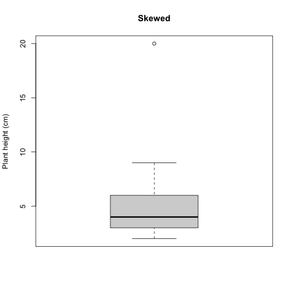

# Descriptive statistics

## A short statistical review

### What can statistics tell us?

Welcome to our statistical exploration of the natural world! 

Almost all statistical analysis boils down to answering 1 of 2 questions:

- Do these groups differ?
- Is there a relationship between these variables?

These seem like relatively simple questions to answer, perhaps just by looking at our data, so **Why do we need statistics?** 

The short answer is: **error** and **sampling**! Whenever we collect data, we introduce **error**; our instruments are imprecise and do not capture an exact measure of whatever you are measuring (e.g., height, weight), and humans make mistakes during measurement collection. Secondly, we are **always** measuring a sub-sample of the true population (*true population* meaning all representatives of whatever you are trying to measure; this can be grass, marbles, or the tibia of humans). Not only is it intractable in most cases to measure all individuals of whatever you are interested in, even when it is possible to attempt to measure **all** individuals (like in the case of rare plant work), statistics acknowledges that it is **still** unlikely that we are able to do so, since individuals may be dormant or challenging to locate. If we could measure all individuals of our focal population with perfect accurately, we could calculate population **parameters**, or quantities describing populations like averages and variation, rather than estimating these metrics, and just compare them. In this way, statistics is inherently practical, and asks: What can we say about whatever we are looking at, given our numerous flaws?

### Sampling populations
After a few classes, we will explore sampling methodology in greater depth in order to design appropriate experiments that test a statistical **hypothesis**. Let's quickly talk about sampling now so that we have a shared understanding and vocabulary to build on - after all, statistics really centers around estimating characteristics of a true population from a sample. The **really, truly** amazing thing is that by properly applying statistics, we can learn practically anything about almost any population using samples!

In statistics, a **population** refers to the all units of the thing that you are interested (i.e., all suriname frogs, all grains of sand, all aspen leaves from a genotype found in southern Arizona). **Note**: Population in statistics differs from the term population in population ecology, where a population refers to a group of individuals in a particular area that interbreed. 

A **sample** is a subset of the population that we measure to infer something about the population. 
**Statistical analysis is only one part of presenting your research results.** Generally, a results section in a manuscript includes: **statistical results**, **data description** (e.g., describing means, ranges, maxima, minima of groups of interest), and **data visualization** (i.e., creating beautiful figures). 

## Objectives

We will build to towards always providing a complete results section with these three components. In this lab, however, we will focus exclusively on data description and a teeny bit of visualization. 

## Downloads for this lab

Last week, you should have created a folder to keep files for lab. Download these materials and place in your folder:

- For your reference, here is a guide that shows the basics formulas for calculations in R: [Supplementary Material](https://drive.google.com/uc?export=download&id=1jhqzC8Qms-KajOj60hCt1jegW1b1BQPU)

- [Download the example dataset](https://drive.google.com/uc?export=download&id=11ul4c3e6Ucqml5bmwiPmC81vgCEVno3D)

The code can be used to import the data, but in case you wanted to access the data yourself - provided above!

- Build on this code, to generate your description of the petal lengths of your focal species:
[R Script for Chapter 1](https://drive.google.com/uc?export=download&id=1vyxsv3L2-zMJ3MXUd0duMRngvuuYRZc9)

- [Watch this video if you need additional help](https://youtu.be/sSPQRhNgZF0)

Remember to alter the working directory, so that you are importing and exporting files from the folder for this lab.

## Data types

Before we start learning to present research results (analysis, description, visualization), let's talk about data! Data comes in several varieties, and the variety dictates which statistical analysis we choose! 

*Categorical variables* are non-numeric variables. 
**Examples**: Pet type (dog, cat, fish, bird), Size (small, medium, large), Car type (sedan, SUV), Present/Absent

*Numerical variables* are variables that are numbers, and occur in two forms:
*Discrete* = Counts of things (no decimal points/fractions)
Data are discrete when it does not make sense to have a partial number of the variable. For instance, if counting the number of insects in a pond, it does not make sense to count a half a species.
**Examples**: Number of people in a building, number of trees in a plot, number of bugs in a pond 

*Continuous* are numerical data that can occur at any value. 
These are variables that can occur in any quantity. If you can have a fraction of this variable, it is continuous.
**Examples** = Height, Weight, Length

*Ordinal variables* (sometimes referred to as ranked) can be categorical or numerical, but the order matters.
**Examples** = Grades (A, B, C, D, E), Likert scale variables (Strongly disagree, Agree, Strongly Agree), Class rank (1, 2, 3, 4, 5)

## Descriptive statistics

Descriptive statistics quantify characteristics of a population. Critically, they are *not* statistical tests, which tell us whether groups differ or if variables are related, BUT they are an important part of scientific work and data analysis. First, we will start by describing continuous data.

Let's use a simplified version of a dataset that I'm working with right now to look at the performance of several species of pollinator-friendly native species in agricultural gardens. Eventually, we'd like to develop seed to provide to restorationists for restoration of arid and semiarid grasslands. To do this, we need to understand how reliable these species are at establishing, producing seed, and attracting pollinators. Initially, we are conducting experiments with multiple populations of each species to determine how consistently plants grow, reproduce, and perform. Here, We will take a look at the initial heights of 1 population of one species, *Asclepias subverticulata*. 

Most of the time when writing up results, you present a mean (sum of numbers divided by the number of observations), and an estimate of variation (a measure of how different the observations are). Here, we calculated three estimates variation, variance, standard deviation, and standard error.

**For the following sections of code, practice code is in your R file**

```{r}
#create vector of heights (cm) of one population of A. subverticulata
sedonapopulation <- c(3, 3, 3, 3, 7, 8, 9)
#take the mean
mean(sedonapopulation)
#calculate variance
var(sedonapopulation)
#calculate standard deviation
sd(sedonapopulation)
#calculate standard error
#base r doesn't have this function
#so we have to write our own
std_error <- function(x) sd(x)/sqrt(length(x))
std_error(sedonapopulation)
```

Since you will occasionally need to include equations in your write-ups, let's get use to mathematical syntax, with these simple examples.

The formula for the sample mean is: $\mu = \frac{\Sigma x_i}{n}$;
where $\mu$ indicates the sample mean (sample = group of numbers we are looking at);
$\Sigma$ means to add what ever follows; 
$x_{i}$ is the value of one observation; (subscript i is often used to indicate that the action should be repeated for all values);
$n$ is the number of observations

*Why didn't we just use $\bar{x}$ to indicate the mean?* 
Because statisticians typically use $\bar{x}$ to indicate the true mean of the population, and $\mu$ to indicate the sample mean!

Just to show you, what the mean() function is doing, let's run:

```{r}
sum = 3+3+3+3+7+8+9 #add all the numbers in the sample
n = length(sedonapopulation) #or you can just calculate the number of height measurements
mean = sum/n; mean #divide sum by number
```

This formula is simple, but sometimes with more complex formulas, I will solve the equations by hand, to make sure that I understand what is happening!

The formula for variance is: $S^{2} = \frac{\Sigma(x_i - \mu)^{2}}{n - 1}$
where $S^{2}$ is the sample variance;
$\mu$ is the sample mean (remember from above);
$x_{i}$ is the value of one observation;
$n$ is the number of observations

In other words:

```{r}
#We determine how much each observation varies from the mean.
diffobs1 = mean - 3
diffobs2 = mean - 3
diffobs3 = mean - 3
diffobs4 = mean - 3
diffobs5 = mean - 7 
diffobs6 = mean - 8
diffobs7 = mean - 9 

#Then we square each of these. 
diffobj1_sq = diffobs1^2
diffobj2_sq = diffobs2^2
diffobj3_sq = diffobs3^2
diffobj4_sq = diffobs4^2
diffobj5_sq = diffobs5^2
diffobj6_sq = diffobs6^2
diffobj7_sq = diffobs7^2
```

*Why do we square the differences rather than just adding them up?* 
Because differences will be positive and negative. If we added them without squaring, sample differences would negate each other. We want an estimate of the absolute differences of samples from the mean.

```{r}
#Then we add the differences up.
sumofsquares = sum(diffobj1_sq, diffobj2_sq, diffobj3_sq, diffobj4_sq, diffobj5_sq, diffobj6_sq, diffobj7_sq)
#Divide the sum of squares by n - 1.
variance = sumofsquares/(n-1); variance 
```

*Why n - 1 instead of n?*
One reason is that, theoretically, because we are taking the mean of a sample, rather than all individuals, we underestimate the variance, so taking n-1 corrects that bias. Consider it a penalty for measuring a sample, not the entire population! Another practical reason is that dividing by n-1 makes the variance of a single sample undefined (unsolvable) rather than zero (solvable)

For standard deviation, we just take the square root of the variance, to remove the effect of squaring the differences when calculating the variance, and thus contextualizing our estimate of variation with regard to the mean. For example, the variance for the Sedona population is 7.48, larger than the sample mean of 5.12; while the standard deviation is 2.73, indicating that you would expect most observations to be 5.12 +/- 2.73 (we'll get to quantiles in a minute).

The formula for standard deviation is: $\sigma = \sqrt\frac{\Sigma(x_i - \mu)^{2}}{n - 1}$
where $\sigma$ is the sample variance;
$\mu$ is the sample mean;
$x_{i}$ is the value of one observation;
$n$ is the number of observations.

Finally, standard error and confidence intervals (we'll get to confidence intervals later) are the most common metrics of variance presented in journals. 

The formula for standard error is: $SE = \frac{\sigma}{\sqrt n}$ 
where $SE$ is standard error of the sample;
$\sigma$ is the standard deviation; and
$n$ is the number of samples.

*Why do we divide the standard deviation by the square root of the sample size to get standard error?*
While standard deviation measures the variation of the sample, standard error is meant to estimate the variation of the entire population of samples, if we could measure all individuals accurately. By dividing by the $\sqrt n$, the larger the sample size, the lower the error, because you have a more complete estimate of the true mean. In other words, standard deviation is just a measure of the variation of our sample, while standard error also incorporates information about our sampling process (how many individuals we have sampled). *Want to delve deep into standard error and deviation (me neither - ha)?: Google central limit theorem + standard error / standard deviation.* 

Means and variance measures are the most common way to describe quantitative data. However, several other metrics are useful for understanding the nature of your data and making decisions about analyses. A comprehensive understanding of your dataset includes describing these four features:
*Location (Mean, Median)
*Spread (Variability)
*Shape (Normal, skewed)
*Outliers

We've talked about means. The median is just the central number in the dataset, and helps you identify skewness.

```{r}
#an example of an unskewed population
sedona_unskewed <- c(1, 2, 3, 4, 5, 6, 7)
mean(sedona_unskewed)
median(sedona_unskewed)

#previous sedona population; skewed
sedonapopulation <- c(3, 3, 3, 3, 7, 8, 9)
mean(sedonapopulation)
median(sedonapopulation)
```

In an unskewed population, the mean will equal the median. Skew may not seem important, but it has statistical ramifications, AND it tells us something meaningful about the data. For instance, what if I said that mean price of a home in Flagstaff is 350K, but the median price of a home is 300K? We would know the that average house prices are driven up by a smaller number of expensive homes. 

We can quantify skew by comparing means and medians (mean > median = right-skewed; median > mean = left-skewed), but it is helpful to visualize the shape of data with a **histogram**. A **histogram** is a graph of the frequency of different measurements.

Let's add a few more observations to our Sedona populations (skewed and unskewed) and check out the look of the data!

```{r}
sedona_unskewed <- c(7, 2, 2, 3, 3, 3, 3, 6, 6, 5, 5, 5, 5, 4, 4, 4, 4, 4, 4, 0.5)
mean(sedona_unskewed)
median(sedona_unskewed)
#I'm renaming sedonapopulation, sedona_skewed for this example
sedona_skewed <- c(3, 3, 3, 3, 7, 3, 4, 5, 6, 3, 3, 3, 4, 4, 6, 7, 8, 9, 3, 4, 5, 2)
mean(sedona_skewed)
median(sedona_skewed)
```

```{r histogram-plot-save, echo=FALSE, fig.cap="Histogram unskewed plant height"}
png("histogram_plantheight.png")
hist(sedona_unskewed, main = "Unskewed", xlab = "Plant height (cm)", breaks=5)
dev.off()

```

In this relatively unskewed example, the tails are approximately even. This shape is also referred to as a normal or Gaussian distribution.

```{r histogram2-plot-save, echo=FALSE, fig.cap="Histogram unskewed plant height"}
png("histogram_plantheight2.png")

h <- hist(sedona_unskewed, main = "Mostly Unskewed", xlab = "Plant height (cm)", breaks=5)

xfit <- seq(min(sedona_unskewed), max(sedona_unskewed), length = 40) 
yfit <- dnorm(xfit, mean = mean(sedona_unskewed), sd = sd(sedona_unskewed)) 
yfit <- yfit * diff(h$mids[1:2]) * length(sedona_unskewed) 

lines(xfit, yfit, col = "black", lwd = 2)

dev.off()

```

Here, we superimposed the bellshaped Normal or Gaussian distribution. 

```{r histogramskewed-plot-save, echo=FALSE, fig.cap="Histogram skewed plant height"}
png("histogram_skewedplantheight.png")
hist(sedona_skewed, main = "Skewed", xlab = "Plant height (cm)", breaks = 5)
dev.off()

```

In this example of skewed data, the tail tapers to the right, indicated that the data is skewed to the right.

In order to explain outliers, we need to look at quantiles! Quantiles are proportions of your data, in other words a way to break your data into chunks to understand spread. You can break your data into as many quantiles as you would like, but it is most common to break your data into 4 parts, also called quartiles. (If you break data into 5 parts, the components are called quintiles, 10 parts = deciles, 100 parts = percentiles). 

When you break data into quartiles, roughly 25 percent of the data occurs within each data chunk. The first chunk of the dataset contains 25% of the data (25th percentile; 25% of the data fall at or below this cut-off) is called the first quartile, the 50th percentile is called the sample median or the second quartile, the 75th percentile is called the third quartile. 

Box and whisker plots are commonly used to quickly examine quartiles. Let's check out our plant height data again, using a box and whisker plot.

```{r boxplot-plot-save, echo=FALSE, fig.cap="Histogram skewed plant height"}
png("boxplot_skewedplantheight.png")
boxplot(sedona_skewed, main="Skewed", ylab="Plant height (cm)")
dev.off()

```

In the plot shown here, the box encapsulates the Interquartile Range (IQR); the center of the data ranging from the 25th percentile to the 75th. The black line in the middle of the box is the median (also called the 50th percentile, because it bisects the dataset; half of the data occur above the median and half below). The lines emerging from the box (whiskers) indicate the extent of the first and third quartiles, and usually corresponding with the minimum and maximum values of the dataset, unless there are **outliers**. An outlier is a datapoint that occurs outside of the 1st or 3rd quantile. Let's add one to our Sedona dataset, and see how it is represented on the box and whisker plot.

```{r boxplot-skewed-plot-save, echo=FALSE, fig.cap="Histogram skewed plant height"}
png("boxplot_skewedplantheight2.png")
#Let's add a plant height of 20.
sedona_skewed <- c(3, 3, 3, 3, 7, 3, 4, 5, 6, 3, 3, 3, 4, 4, 6, 7, 8, 9, 3, 4, 5, 2, 20)
boxplot(sedona_skewed, main="Skewed", ylab="Plant height (cm)")
dev.off()

```

The outlier appears as a dot on the box and whisker plot, and is the maximum value of the dataset. 

One other thing to note: Standard deviation also breaks data into meaningful segments, but is only used when data conform to a normal distribution; the mean +/- 1 SD accounts for 68% of the data, +/-2 SDs contains 95% of data, and +/- 3SD includes 99% of data. That said, I've never presented standard deviation in a manuscript; it is much more common to include standard error or confidence intervals (discussed later).

## Figures

Figures are a common way to show key elements of your data or statistical analysis. In this tutorial, you've seen both histograms and box plots (aka box and whisker plots). When presenting results in a scientific manuscript or report, figures will be accompanied by figure legends. A good figure legend provides the following information:

1. A description of what the figure is showing you. 
2. For complex figures with multiple panels, an orientation to the structure of the figure
3. Explanation of any symbols, colors, and/or lines
4. Description of how variance is quantified
5. Definitions of axes or units, if unclear
6. Acknowledgment of data source, if data source requires attribution
7. Implications of the figure (optional)

Here is an example figure legend of a hypothetical figure showing species richness as a function of temperature across ecosystems:

**Figure 1.** Species richness increases with temperature across ecosystems. Panel A shows the mean species richness across three ecosystems: grassland (green), forest (blue), and desert (orange) from 2015 to 2020. Panel B depicts the temperature variation in these ecosystems during the same period. Circles represent data from 2015, while triangles represent data from 2020. The x-axis shows mean annual temperature (°C), and the y-axis shows species richness (number of species per 1000 m²). Error bars indicate ±1 standard deviation. The dashed line represents the best-fit linear regression (R² = 0.85, p < 0.05), showing a positive correlation between temperature and species richness.

## Summary

We've played around a lot with data, but what do you actually need to take away from this? Here are the key takeaways:

1. Understand data types (Categorical, Numerical discrete, Numerical continuous, Ordinal)
2. Know ways to describe numerical continuous data (Location, Spread, Shape, Outliers)..
3. Be able to calculate mean, median, and standard error.
4. Familiarize yourself with mathematical annotation.
5. Familiarize yourself with R code.
6. Be able to interpret a histogram and box-whisker plot.
7. Be able to construct an appropriate figure legend.

## Assignment

Now, let's play around a little more with R! 

Let's also try describing the petal lengths of 3 different plant species: Milkweed, Bluestar and Pectis using the dataset that you downloaded.

Please put your results in a document and submit to your TA in Canvas! Be sure to include:

1. Summary statistics for your flower species (mean, median, and se)
2. Plots that you create
3. Appropriate figure legends for each plot, including a description of the data that a box plot shows.


