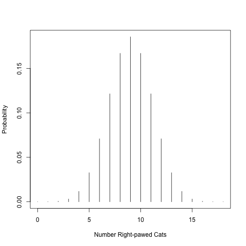

# Basic statistical testing 

## A short statistical review

### What can statistics tell us?

Welcome to our statistical exploration of the natural world! 

Almost all statistical analysis boils down to answering 1 of 2 questions:

- Do these groups differ?
- Is there a relationship between these variables?

These seem like relatively simple questions to answer, perhaps just by looking at our data, so **Why do we need statistics?** 

The short answer is: **error** and **sampling**! Whenever we collect data, we introduce **error**; our instruments are imprecise and do not capture an exact measure of whatever you are measuring (e.g., height, weight), and humans make mistakes during measurement collection. Secondly, we are **always** measuring a sub-sample of the true population (*true population* meaning all representatives of whatever you are trying to measure; this can be grass, marbles, or the tibia of humans). Not only is it intractable in most cases to measure all individuals of whatever you are interested in, even when it is possible to attempt to measure **all** individuals (like in the case of rare plant work), statistics acknowledges that it is **still** unlikely that we are able to do so, since individuals may be dormant or challenging to locate. If we could measure all individuals of our focal population with perfect accurately, we could calculate population **parameters**, or quantities describing populations like averages and variation, rather than estimating these metrics, and just compare them. In this way, statistics is inherently practical, and asks: What can we say about whatever we are looking at, given our numerous flaws?

### Sampling populations
After a few classes, we will explore sampling methodology in greater depth in order to design appropriate experiments that test a statistical **hypothesis**. Let's quickly talk about sampling now so that we have a shared understanding and vocabulary to build on - after all, statistics really centers around estimating characteristics of a true population from a sample. The **really, truly** amazing thing is that by properly applying statistics, we can learn practically anything about almost any population using samples!

In statistics, a **population** refers to the all units of the thing that you are interested (i.e., all suriname frogs, all grains of sand, all aspen leaves from a genotype found in southern Arizona). **Note**: Population in statistics differs from the term population in population ecology, where a population refers to a group of individuals in a particular area that interbreed. 

A **sample** is a subset of the population that we measure to infer something about the population. 
**Statistical analysis is only one part of presenting your research results.** Generally, a results section in a manuscript includes: **statistical results**, **data description** (e.g., describing means, ranges, maxima, minima of groups of interest), and **data visualization** (i.e., creating beautiful figures). 

## Hypothesis testing review

Ahhhh the scientific process:  A researcher makes observations about the natural world, generates a hypothesis to test, tests the hypothesis, rejects or fails to reject the hypothesis, and reports these findings. A simple, yet glorious process that has led to incredible discoveries! Statistical hypothesis testing answers very simple questions, while scientists work in very complex knowledge environments. For beginning researchers, it is important to understand what statistics can tell us, and how this builds information to address amazing and very interesting research questions. Hypotheses allow us to articulate exactly what we are testing in statistics and to organize thoughts and analyses. 

## Downloads for this module

Download this file to the folder you created for this lab:

- [Download the R file](https://drive.google.com/open?id=1-mBgBLuGHaKlvPWArRw1XkE_1DpWJyzx&usp=drive_fs).

As you read the tutorial, follow along in the R code. Then, use the code to finish your assignment.

## Objectives

We will highlight the basic components of a statistical test with a very simple statistical 'tailed' test. Today, we will:

1. State a hypothesis
2. Calculate a test statistic
3. Determine the p-value
4. Interpret results

The **null hypothesis** ($H_0$) is a statement about a population parameter that would be interesting to reject. The null hypothesis typically asserts that there is no effect or relationship or that results will not deviate from established knowledge.

For instance:

- The mean height of giraffes in captivity and in the wild do NOT differ.
- The incidence of toenail fungus is the SAME in the control group and the group given anti-fungal medicine.
- There is NO relationship between sea grass height and the number of sea snails.
- The mean human body temperature is 98.6 degrees Fahrenheit. 

Null hypotheses are paired with **alternative hypotheses** ($H_A$) that represent ALL other possibilities other than that stated in the null hypothesis. 

For instance:

- The mean height of giraffes in captivity and in the wild differs.
- The incidence of toenail fungus is different in the control group and the group given anti-fungal medicine.
- There is a relationship between sea grass height and the number of sea snails.
- The mean human body temperature is not 98.6 degrees Fahrenheit. 

Note that the null hypothesis is very **specific**, while the alternative hypothesis is **general**. Statistical tests are designed to either reject or fail to reject the **null** hypothesis.

## Tailed tests

Tailed tests are very simple tests for comparing means or proportions, and are great for illustrating the basic components of a frequentist statistical analysis. Let's walk through an example! Handedness is common in humans. Around 90% of humans preferentially use their right hand. You've been watching your cat, Geraldo, play with his toy mouse, and you notice that he preferentially uses his right paw to bat the mouse around. You start to wonder if cats display handedness like humans! You run around visiting cats and observing their paw usage and determine that 14 cats of the 18 you observe appear to be right-pawed, while only 4 preferentially use their left paw. Is this enough evidence to suggest that cats display 'handedness' or did this pattern just emerge by chance?

### Generate hypotheses

*What is the null hypothesis in this case?* Remember it must be specific so that we can either reject or fail to reject the null!

$H_0$: Left and right-pawed cats are equally frequent in the population (i.e., Cats are not right or left-pawed). 

Note that this null hypothesis is very specific. If we would describe this mathematically, we would say that we expect half the cats (9 / 18) to use their right paws and half to use their left paws. If we express this as a proportion, ($p$), we are testing whether $p$ = 0.5. Very specific.

*What is the alternative hypothesis?*

$H_A$: Left and right-pawed cats are not equally frequent in the population.

Note that the alternative hypothesis is very broad and encompasses all other possibilities. Because, in theory, we could observe proportions below 0.5 (1/18 cats are right-handed) or above 0.5 (16/19 cats are right-handed), we refer to this as **two-tailed**. 

**In a two-tailed test, the alternative hypothesis includes parameters on both sides of the value specified by the null hypothesis.**

Before we move on, can you think of an example of a 1-tailed test?

**Don't look before guessing!**

Here are some examples:

- Did you score better than the class average?
- Is the time to getting to the student union less than 10 minutes when you avoid driving through campus?

Note the difference with the 2-tailed test: we are only interested in values in one direction. In the first example, we are interested in whether your score is >80% (class average). In the second, we are interested in whether your drive time is <10 minutes (time to the student union driving through campus from your house). 

How could you phrase the first example to be a 2-sided test?

**Don't look before guessing!**

It could be something like this: Was my score different than the class average? In this case, your score could be higher or lower.

### Calculate a test statistic

We generated our hypotheses. Let's calculate a test statistic. What is a test statistic? 

**A test statistic is a quantity calculated from that data used in statistical analysis to evaluate the null hypothesis.**

For this simple test, our test statistic will be 14, since this is the number of right-handed cats we observed. We want to ask whether observing 14 out of 18 cats using their right paw is truly different from the null (9 out of 18 cats using their right paw), or did this pattern occur by chance in our sample?

### Determine the p-value

Frequentists statistics is based on the concept of statistical distributions. If we run many trials, we can determine the likelihood of certain events occurring by chance. We refer to the patterns of occurrence of trials as frequency distributions. Let's illustrate using the data above. A cat can either be right-handed or left-handed (in this case there are no ambidextrous cats). To determine the likelihood that our pattern arose by chance, we conduct numerous trials like a coin toss. We would randomly flip a coin 18 times and record the outcome of each trial; heads being right-pawed, and tails being left-pawed. 

In class: 

- Each student took a coin. 
- Flipped the coin 18 times and recorded number of heads. 
- Divided by total number of trials (in this case students) to derive relative frequency for each event.

If we would flip the coins many times, we probably generated something that looks like the figure generated by running the code below (run in your R code to generate the figure). This is referred to as a probability distribution and expresses the relative frequency of particular events occurring. Frequentist statistics derives its name from this probability distribution.


```{r binomial-plot-save, echo=FALSE, fig.cap="Binomial probability distribution"}
paws <- 0:18
png("binomial_plot.png")
plot(paws, dbinom(paws, 18, 0.5), type='h', ylab="Probability", xlab="Number Right-pawed Cats")
dev.off()

```

Here is a table of those probabilities:

```{r}
probability <- dbinom(paws, 18, 0.5)
N <- 0:18
pawtable <- cbind(N, probability)
pawtableF <- as.data.frame(pawtable); pawtableF
```

Take a look at the chart. What is the probability of observing right pawedness in 14 out of 18 cats? Is this difference from the null (9 cats are right-handed, no better than random) big enough to reject the null? To determine this we calculate a p-value.

**A p-value is the probability of obtaining the data that we observe if the null hypothesis were true.**

In this case, we will generate a p-value for a two-tailed test. To do this, we will add the probabilities of observing 14 right pawed cats or more by chance AND for the possibility of observing 4 or fewer right paws, which would indicate left pawedness. 
P-value = Pr[14] + Pr[15] + Pr[16] + Pr[17] + Pr[18] + Pr[4] + Pr[3] + Pr[2] + Pr[1] + Pr[0]

Recall that we can add these probabilities up, since, in our example, we say that being right or left pawed are mutually exclusive events.

```{r}
pvalue <- (0.0117 + 0.0031 + 0.0006 + 0.00007 + 0.000004)*2; pvalue
```

We generate a P-value of 0.031.

In most sciences, we have agreed on a threshold of 0.05 for establishing statistical significance. If p-values are less than or equal to 0.05, we reject the null hypothesis. If larger, we fail to reject. 

**The significance level, $\alpha$, is a probability used as a criterion for rejecting the null hypothesis.**

This significance level is important. In the sciences, we would rather err on the side of *not* identifying a pattern, rather than saying there is a pattern, when there it doesn't actually exist. This concept is included in the in the discussion of *statistical errors**. 

A Type I error is when you reject a true null hypothesis. You are saying there is a difference, when actually, if could perfectly measure your focal population, there is no difference. By establishing a significance level ($\alpha$) of 0.05, we are saying that we are willing to accept that 5% of the time, we will say there is an effect when there isn't one.  

A Type II error is failing to find a pattern or a difference when there actually is one. If you reduce your $\alpha$ to reduce your likelihood of making a Type I, you increase the likelihood of committing a Type II error.

The probability of committing a Type II error is more challenging to quantify and is related to the concept of **statistical power**. A study with high **power** has a low likelihood of committing a Type II error. Statistical power depends on several things, including **sample size**, the magnitude of the **effect** of the treatment, and **variation** within the sample. A study with a LARGE sample size, a BIG treatment effect, and SMALL variation within samples will have high statistical power. We will talk about calculating statistical power later.

## Drawing conclusions from statistics

In this case, we **reject** the null hypothesis, and state that our results **support** the alternative hypothesis that there is handedness in cats. Note that we 'support' the alternative hypothesis, rather than saying that there is pawedness in cats or accepting the alternative hypothesis. Statements about statistics are phrased to reflect that we are dealing in probabilities, and there is always a chance that our findings are incorrect. Additionally, statistical tests specifically test the null hypothesis, not the alternative (for which there are often many possibilities).

What would we say if we didn't reject the null? We would state that we **failed to reject** the null hypothesis. Failing to reject the null indicates that our sample did not provide sufficient evidence to conclude that the effect exists, but lack of evidence doesn't prove that the effect does not exist. For this reason, we never accept the null. 

## Reporting results

When we report findings, we will provide:

1. A statement of findings
2. The test statistic
3. The P-value
4. A description of differences, if differences exist
5. A visualization of differences, if differences exist

Here is how we might report the written results of our previous test:

Cats displayed higher levels of handedness than expected by chance (t = 14, p = 0.03). Around 78% of cats preferentially use their right paw (**Fig. 1**). 

**Note that it is common to include up to 2 decimal places in the results statements.If p-values are less than 0.01, it is common to report the p-value as p < 0.01.**

## Assignment

We will now apply the tailed-test to a new question! You think that your dog, Rupert, prefers blue to red. You want to know: Do dogs prefer the color blue?

Provide the following information in a document and turn into your TA:

1. What is your null hypothesis? 
2. What is your alternative hypothesis?

You invite all your friends with dogs, place both red and blue balls on the ground, and see if how many times the dogs select the blue ball out of a series of 10 trials. Ten of friends with dogs participate and you record the number of times that the dogs select the blue ball. Run the t-test in R!

3. Provide a corrected crafted results statement describing the outcome of the test. Please correctly structure your results statements, and make sure that you have included the 5 components mentioned above.

4. For your figure, please include a properly formatted figure legend. Recall from last lesson, the key parts of the figure legend:

- A description of what the figure is showing you. 
- For complex figures with multiple panels, an orientation to the structure of the figure
- Explanation of any symbols, colors, and/or lines
- Description of how variance is quantified
- Definitions of axes or units, if unclear
- Acknowledgment of data source, if data source requires attribution
- Implications of the figure (optional)


