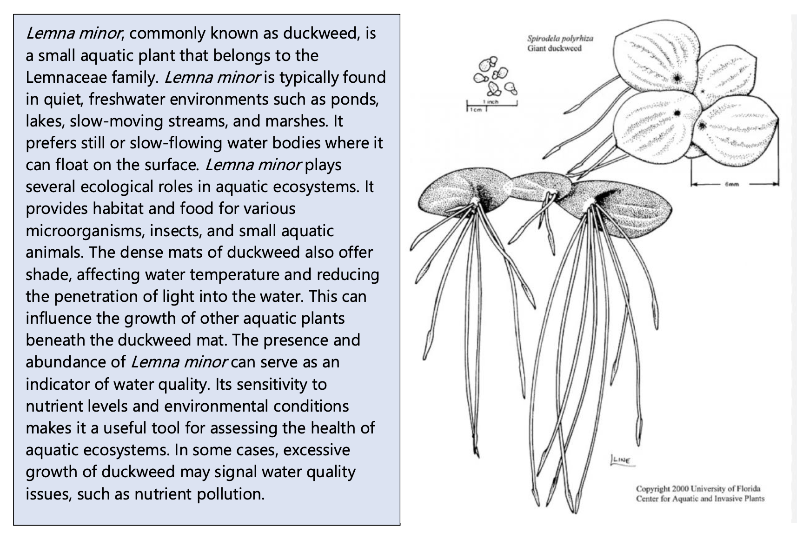
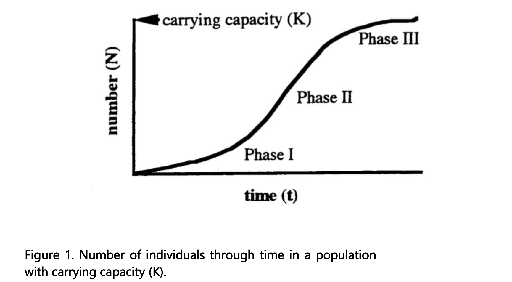

# Population ecology

## Lab set-up (week 1)

In a few weeks, we will complete a lab on the population dynamics of duckweed (*Lemna minor*) in microcosms. Today, we will set up your experiment. Next week, you will collect data on your populations and maintain your experiment.

### Downloads for this lab

[Download the CSV file](https://drive.google.com/uc?export=download&id=1mtEFQQcmza9Sk5jmWpQKehy87nG8gKBP)

[Download the R file](https://drive.google.com/uc?export=download&id=1u3DzlEIM3NwZzNC9ebvyOqXmwaztYysZ) 

### Objectives
To investigate population dynamics of duckweed using microcosms.

### Materials
1.	Microcosms (i.e., clear plastic containers)
2.	*Lemna minor* individuals 
3.	Water
4.	Small labels or markers
5.	Light source (natural sunlight or artificial light)
6.	Data recording sheets

First, we will explore growth rates of populations with two different initial population sizes. Working in groups of 3 – 5, follow the procedure below. Then, proceed to setting up your experiment in which nutrient levels are varied! 

### Procedure
1.	Fill two microcosms with artificial pond water, 200 ml. Mark the 200 ml water level on the cup so that you can refresh the culture solution to the same volume. 
2.	Place two healthy Lemna plants in one of the cups. Place 15 health Lemna plants in the second cup.
3.	Because a plant can consist of one or more thalli, it is necessary that you now count the number of thalli in each cup. One thallus is any leaf unit that is over 1.5 mm. Record these data in the Day 0 column of Table 1.
4.	Place the cups under fluorescent or near natural lights for a period of two weeks, check them periodically to refill the cups to the 200 ml line.
5.	Count the number of thalli in each cup on Day 7 and Day 14. These counts are already reflected in the datasheet for this lab, but you will need to record population size going forward 

Here is some information on *L. minor* to assist you!

## Maintaining your microcosms and measuring population growth (week 2)

1.	Check the microcosms and refill the cups to the 200 ml line.
2.	Count the number of thalli in each cup on Day 7 and Day 14. Record these data in the population size column of your datasheet.

## Final data collection and analysis (week 3)

In this lab, we will collect data from your microcosms and analyze your results. First, we will learn a little more about microcosm studies in ecology, your model organism, and some population ecology background.

### Microcosm studies of population dynamics

Microcosms in ecological sciences are small-scale experimental systems that replicate natural ecosystems. Researchers use microcosms to study ecological interactions, nutrient cycling, and other ecological processes in a controlled environment. Here we will use microcosms to examine population dynamics of duckweed (*Lemna minor*) to gain insights into core concepts in population ecological, such as population growth and carrying capacity.

In class, we discussed how populations have the capacity to grow **exponentially**, but resource availability eventually limits population growth. Light, space and nutrients are all examples of resources that may be limited within ecosystems and constrain population growth. Here, we will explore populations growth using the model species, *L. minor*.  A **model organism** is a species used in scientific research to represent a broader biological phenomenon, serving as a convenient and well-understood subject for studying fundamental biological processes.

Over the last few weeks, you have been establishing and maintaining microcosm experiments with duckweed (experiment modified from Population growth:  Experimental models using duckweed (Lemna spp.); University of Toronto, Toronto CANADA). 

Few plants are suitable for studying continuous population growth because most plants have life cycles with discrete jumps in population size, their reproduction is seasonal and they respond to changes in population density by changing size and shape instead of population number (Harper, 1977). However, free-floating aquatic plants such as duckweeds (*Lemna* spp) or water ferns (*Azolla* and *Salvinia*) undergo continuous growth and therefore are excellent models for quantifying aspects of population growth (Clatworthy and Harper, 1962; Harper, 1977). 

These plants are stemless and have only one to four leaf-like structures called thalli (singular = thallus), if they are flowering plants, or fronds, if they are ferns. Roots from the thallus hang free in the water. Duckweeds can reproduce by flowering and setting seed (sexual reproduction) but seldom do. More commonly they reproduce asexually by producing a new thallus or frond directly from an old one. When a new thallus has grown large enough and has roots, it breaks loose from its parent plant and grows on its own as a separate plant. The growth of a population can be followed by counting thalli or measuring changes in biomass (dry weight).

If a pond or lab beaker is inoculated with one or two thalli and conditions are favorable, the plants commence exponential growth (Fig. 1, Phase I). The growth rate of the population under these conditions is density independent; the population grows unimpeded by resource limitation or competition. We can estimate the intrinsic rate of growth (r- see the equations on following pages) by measuring the uninhibited growth of low-density populations. 

As thalli accumulate, the population becomes crowded and limited by the available resources. For a period, growth appears constant (Fig. 1, Phase II) as the width and thickness of the mat of floating plants increases. Eventually the beaker or pond fills with floating plants (Fig. 1, Phase III) and the population reaches a steady state (see the following equations). At this point, for every new thallus that appears, an existing one is shaded and dies, i.e., the population size is stable. The logistic growth curve (Fig. 1) illustrates all three Phases. 

### Population dynamics basics

Using your own or class data (if your experiment has failed), graph the average (mean) number of thalli (N) as a function of time for the cultures that started with two plants and the cultures that started with 15 plants. 

The three equations shown below describe growth of populations:

**Exponential population growth** (expressed by the instantaneous rate of increase, r):
$$
\frac{dN}{dt} = rN
$$
where:
- \( N \) is the population size,
- \( r \) is the intrinsic growth rate, and
- \( t \) is time.

When we are looking over a discrete period of time, we can calculate **Geometric population growth rate**, described by the equation:

$$
N(t+1) = N(t) e^{rt}
$$
where:
- \( N(t) \) is the population size at time \( t \),
- \( r \) is the intrinsic growth rate, and
- \( t \) is time.
- \( e \) is the base of the natural logarithm (constant)

The factor by which a population increases in one unit of time (ert) is the finite growth rate of the population (λ), from:

$$ N(t+1) = N(t) e^{rt} $$
We take the natural logarithm of both sides:
$$
\log N(t) = \log N(0) + rt
$$
This equation now represents a linear relationship between \( \log N(t) \) and \( t \), where:
- The slope of the line is \( r \) (the intrinsic growth rate),
- The intercept is \( \log N(0) \) (the log of the initial population size).

By plotting \( \log N(t) \) vs. time \( t \), the slope of the line provides a direct estimate of \( r \).

When resources are finite, we can rearrange the exponential growth equation to include the carrying capacity of the environment.
The logistic growth model, which accounts for a population's carrying capacity, is described by the equation:

$$
\frac{dN}{dt} = rN\left(1 - \frac{N}{K}\right)
$$
where:
- \( N \) is the population size,
- \( r \) is the intrinsic growth rate,
- \( K \) is the carrying capacity, and
- \( \frac{dN}{dt} \) is the rate of change of the population over time.

**Estimating geometric growth**

Let’s start by plotting population growth through time.

Since population growth rate is exponential, we can plot it as log (N) over time. Plot log N as a function of t for the cultures that started with two plants. The slope of a line drawn through the mean log N at Day 0, Day 7, and Day 14 would approximate r. Make the same graph and calculations for the cultures that started with 15 plants.

Now, let’s calculate the finite rate of increase, \( \lambda \), using the equation:

$$
\lambda = \left( \frac{N_{t+1}}{N_t} \right)^{\frac{1}{t}}
$$
where:
- \( N_{t+1} \) is the population size at the final time point (e.g., Day 14),
- \( N_t \) is the population size at the initial time point (e.g., Day 0), and
- \( t \) is the total time (e.g., 14 days).

As the population of Lemna in your cup grows, the rate of growth will slow down. When the population reaches the carrying capacity of the cup, the growth rate of the population will be 0 (dN/dt = 0). If you plot the geometric growth rate (λ, calculated above) for each cup, as a function of population size (Nt), you should have a linear plot where the y intercept (where N = 0) would approximate r and when λ = 1, n = K. We derived that information by rearrange your formula for carrying capacity:

**Estimating \( r \)**:
- The intercept of the linear model (where \( N = 0 \)) is an approximation of the intrinsic growth rate \( r \).

**Estimating \( K \)**:
- The carrying capacity \( K \) is estimated by solving the equation where \( \lambda = 1 \) (i.e., when the population growth rate reaches zero):

$$
K = \frac{1 - \text{intercept}}{\text{slope}}
$$
**Plot your data. What is your estimated carrying capacity (K)?**

## Assignment

Please turn into your TA, your:
1. Estimates of r for both populations & associated figure
2. Estimates of finite population growth
3. Estimate of carrying capacity & associated figure
4. Summarize the findings and draw conclusions about the factors influencing population dynamics and discuss the implications of the study for understanding population ecology in natural ecosystems. Be sure to describe any differences in growth rates between the two microcosms and discuss why you might be seeing that pattern.

