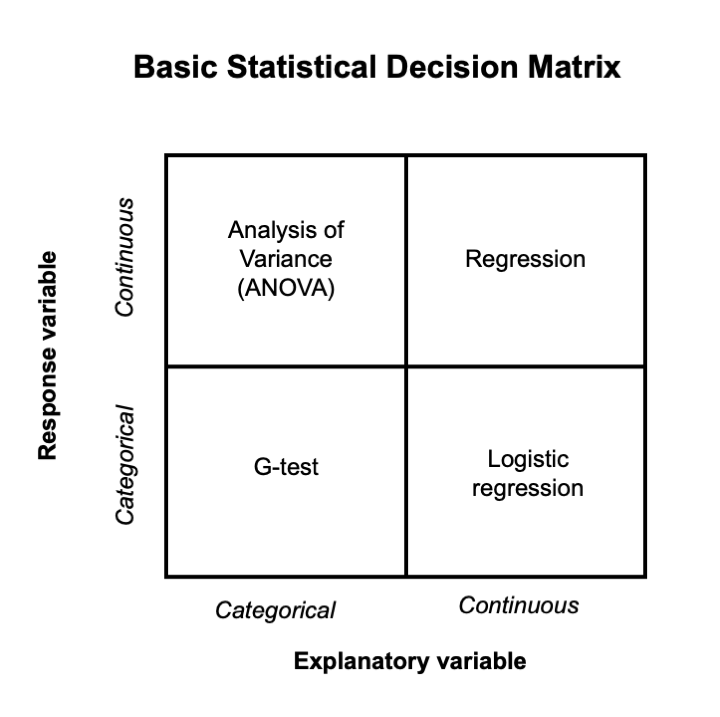

# Selecting statistical tests  

## A foray into statistics  

We've talked about data types, describing data, and basic hypothesis testing. This week we are applying these concepts to run a statistical analysis. When conducting an analysis, a dataset will contain one or more **response variables** (aka *y-variables*, dependent variables) and one or more **explanatory variables** (aka *x-variables*, independent variables). Explanatory variables are used to explain variation in response variables.  

**The data type of both the explanatory and response variables determines which statistical test we use**. Selecting the right test is important because it ensures that we’re asking a question our data can actually answer.  

## Pick the explanatory and response variable  

Imagine that we want to identify areas that support high numbers of plants from the genus *Mitella*. We hypothesize that *Mitella* occurrence is positively related to water supply (i.e., the number of *Mitella* plants goes up as water availability increases).  

In this example the:

1. **Response Variable (Y)** is the number of *Mitella* plants in a specific area (continuous count data).  
2. **Explanatory Variable (X)** is the Water availability (continuous).  

In this case, both the explanatory and response variables are continuous, so we might test their relationship using **regression**.  

## Variable types refresher  

| Variable Type | Examples | Notes |
|---------------|----------|-------|
| **Categorical (nominal)** | Species identity, treatment group (control vs. watered) | Categories with no natural order |
| **Categorical (ordinal)** | Low/medium/high shade | Ordered categories |
| **Continuous** | Height, biomass, rainfall (measured on a scale) | Quantitative, can take on many values |
| **Count** | Number of seedlings, number of visits by a pollinator | Discrete values (0, 1, 2, …), often treated separately in statistics |  

## More examples  

**Example 1**: Categorical explanatory → continuous response  
- **Question**: Do soil nitrogen levels differ between burned vs. unburned plots?  
- **Test**: *ANOVA* (a one way ANOVA is basically equivalent to a two-sample *t-test*, which we discussed in the chapter on basic statistical testing) 

**Example 2**: Categorical explanatory → categorical response  
- **Question**: Is survival (alive vs. dead) related to treatment (control vs. watered)?  
- **Test**: *G-test* (a type of *Chi-square test*)  

**Example 3**: Continuous explanatory → continuous response  
- **Question**: Does plant biomass increase with light availability?  
- **Test**: *Regression*.  

**Example 4**: Continuous explanatory → categorical response   
- **Question**: Does plant biomass increase survivorship of duckweed?  
- **Test**: *Logistic regression*.  

## The decision matrix  

Below is a simple decision matrix for selecting statistical analyses.  

  

**How to use it:**  

1. Identify your explanatory and response variables.  
2. Decide whether each is categorical, continuous, or count.  
3. Follow the matrix to the test.  

*Example*: Students conducted an experiment by manipulating three levels of competition: low, medium, and high, and evaluated the growth of a species of native pea. Since the explanatory variable is categorical and the response variable is continuous, you would perform an ANOVA.  

## A note on assumptions  

Choosing a test is only step one. Most tests also have **assumptions** (e.g., data are normally distributed, groups have equal variance, observations are independent). If assumptions are not met, we either transform the data or use a non-parametric alternative. We won't perform transformations here, but it is important to understand that this is important when conducting statistics for peer-reviewed research.

## Learning goals  

By the end of this module, you should be able to:  

- Correctly identify explanatory and response variables.  
- Match data types to the appropriate statistical test.  
- Run a statistical test 

## Downloads for this class

- [Download the R file](https://drive.google.com/uc?export=download&id=14tBsHZx8ZBXV-Gf1sxKG_jiNAXwu94dm)
- Completing your species interactions final project and need more help? 
  - [Watch the YouTube tutorial here](https://youtu.be/ZQz770Uzvyo)

## In-class practice

Let's practice these statistical tests in R (these examples are preloaded in your R file)!  

**G-test (Categorical Response and Categorical Explanatory Variable)**

Scenario: You are studying bird nest preferences in a forest. You want to know if birds prefer nesting in different tree species (oak, pine, or maple).

- Response variable: Nest presence (Yes/No)
- Explanatory variable: Tree species (oak, pine, maple)
	
Run the code in R.

**t-test and ANOVA (Continuous Response and Categorical Explanatory Variable)**

**t-test**
Scenario: You want to compare the weight of two species of frogs (Species A and Species B) to see if there’s a significant difference in weight between them.

- Response variable: Frog weight (grams)
- Explanatory variable: Species (A or B)
	
**ANOVA** (Continuous Response and Categorical Explanatory Variable with More Than Two Categories)

Scenario: You are studying the growth of plants in three different habitats: Desert, Forest, and Wetland. You want to compare plant height across these habitats.

- Response variable: Plant height (cm)
- Explanatory variable: Habitat (Desert, Forest, Wetland)

**Linear Regression** (Continuous Response and Continuous Explanatory Variable)

Scenario: You are studying how the number of fish in a river changes with water temperature. You want to model the relationship between water temperature (°C) and fish count.

- Response variable: Fish count
- Explanatory variable: Water temperature (°C)
	
**Logistic Regression** (Categorical Response and Continuous Explanatory Variable)

Scenario: You want to study the probability of a specific bird species’ presence in different areas based on elevation. The response is whether the bird is present or absent.

- Response variable: Bird presence (Yes/No)
- Explanatory variable: Elevation (meters)

---

**Skip this section** if you are using this chapter to run your analyses for your species interaction project.

## Assignment: Choosing and Running the Right Test

Next, let's practice on your own.

For each scenario:

1.	Read the description carefully.
2.	Decide which statistical test is most appropriate.
3.	Modify the code from the examples we’ve covered in class to run the test in R.
4.	Interpret the output using proper results statements.

**Scenario 1**: Comparing Two Groups

A biologist measures the leaf nitrogen content (%) in plants from two different habitats: Sunny vs. Shady. 

- Question: What test should you use to compare nitrogen between habitats?

**Scenario 2**: More Than Two Groups

An ecologist measures the average number of pollinator visits to flowers of three species: Aster, Goldenrod, and Sunflower.

- Question: What test should you use to compare mean visits among these three species?

**Scenario 3**: Relationship Between Two Variables

A forester records tree diameter (cm) and age (years) for a sample of trees.

- Question: What test should you use to test whether tree diameter predicts age?

**Scenario 4**: Categorical Data

A conservationist records whether birds are Present or Absent at two sites: Restored and Unrestored.

- Question: What test should you use to see if bird presence differs between restored and unrestored sites?

### Deliverables 

For each of the 4 scenarios above, run the appropriate statistical test, and provide:

1. Results statements including:

- The correct test statistics

2. Associated figures with correct figure legends.

---

Start here again if using this chapter to analyze data for your species interaction lab

## Statistical analyses for your species interaction lab

Using the statistical tests provided here, select your statistical test based on the data type for your response and explanatory variable, run a statistical test, record your results, and create a figure!

