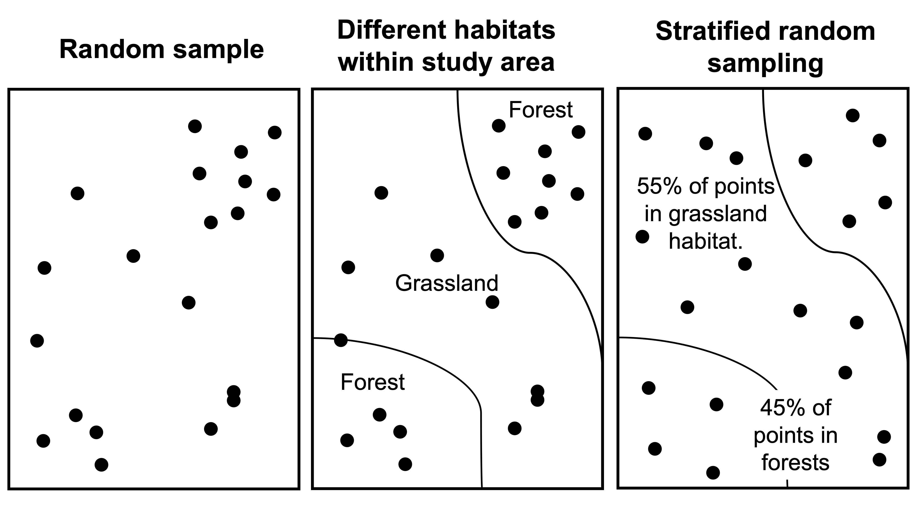

# Ecological sampling

## Background

Ecology is the study of organisms and their relationship to the environment. With infinite time and capacity, we could measure every organism, every characteristic of the environment, every physiological function that affects the way an organism responds to the environment, and every gene that underlies those physiological functions in order to understand ecological systems. In practice, such detailed measurements are time-consuming and impractical. For that reason, we use statistics to account for the fact we are always missing information when we conduct ecological studies. 

In statistics, a **population** refers to the all units of the thing that you are interested in (i.e., all Suriname frogs, all species in a marshland, all grains of sand, all aspen leaves from a genotype found in southern Arizona). Note that the term ‘population’ in statistics differs from the term population in population ecology, where a population refers to a group of individuals in a particular area that interbreed. Statistics accounts for the fact that we never perfectly measure the ‘true population’ or the all units of interest. Luckily, by properly applying statistics, we can learn practically anything about almost any population using **samples**! 

A **sample** is a subset of the population that we measure to infer something about the true population. In order to avoid erroneous conclusions about the population, our sample must be **representative** of the population of interest and **unbiased**. As an example, imagine that you were interested in whether coat color in cats differed between house cats and feral cats. To select the house cat sample, you randomly select house numbers, visit the house and record coat color, thus collecting a random sample. However, to survey feral cats, you go to several cat colonies at night and record the first cat that you see, which are always white or tan. The sampling strategy for feral cats introduces bias, because darker cats are harder to see at night. This causes you to overestimate the number of light-coated feral cats, and underestimate dark-coated feral cats, resulting in the erroneous conclusion that a greater proportion of feral cats are light-colored compared to house cats. Experiments must be carefully planned to reduce bias. 


We can conduct statistical analysis until the cats come home (ha!), but if your sample is biased, our results will always be meaningless. In the cat example, it was pretty obvious that the researcher was introducing bias, BUT it is REALLY easy to introduce bias in ecological and social research on accident! Imagine that you looking at fire effects on vegetative communities in the Sonoran. In high severity burn areas, there are thickets of cat's claw (a pokey plant). Without proper field sampling protocols, it is very tempting to avoid establishing plots in the cat claw thickets, thus not capturing true differences in vegetation along burn severity gradients. Let's talk about several types of appropriate sampling strategies. 

## Sampling approaches

### Random sampling 

In order to reduce bias, researchers **randomize** sampling. **Random sampling** is when every item within the focal population has an equal chance of being selected. In research, random sampling can be applied to selecting experimental subjects, assigning individuals to treatments, or identifying plot locations. It is **REALLY** easy to introduce bias in ecological and social research on accident if you do not use a random sampling technique! Imagine that you are looking at fire effects on vegetative communities in the Sonoran. In high severity burn areas, there are thickets of cat's claw (a pokey plant). Without proper field sampling protocols, it is very tempting to avoid establishing plots in the cat claw thickets, thus not capturing true differences in vegetation along burn severity gradients. In practice, researchers use number generators, like those on your phone, or within computer programs, like ArcGIS, to randomly place sampling points. Here, we’ve included a random number sheet to use to randomly array plots. A random number sheet contains random numbers that someone generated in advance to assist in the field. 

We can quickly and easily generate such a sample in R, using the sample function. 

```{r}
sample(1:100, 10, replace=FALSE)
#1:10000 = numbers to chose among 
#number of random numbers you wish to generate
#to replace or not (in other words do you wish for the same number to be selected multiple times)
```

### Stratefied random sampling

To make a sample representative of the population, you will want to capture the typical state of the population of interest. This is challenging, since prior to collecting data, you do not know the typical state of the population. With an understanding of ecology, however, and precisely describing your research question, you can improve the representation of your sample without a lot of specific a priori (beforehand) knowledge of the target population. One typical approach is referred to as **stratified random sampling**, in which you ensure that you are proportionately sampling from major habitat types or features. In the example in **Fig. 1**, a random sample of the study area overrepresents the forested habitat relative to the grassland habitat. To account for this, the researchers adjust the sampling technique, such that plot locations occur in both of the major habitats proportionally. Since grasslands make up 55% of the study area, 55% of the points would be randomly located in the grassland area. Since there are twenty plots, 11 are placed within grasslands (0.55*20). The remaining 9 plots are then randomly allotted to the forested habitat. 

 
**Figure 1.** Random versus stratified sampling. 

### Gridded random sampling

In complex, multi-species systems, another approach to improve coverage of random sampling is to randomly place plots within a grid (**Fig. 2**). This is to ensure that you capture species, which may have an array of distributions. **Distribution** in plant ecology refers to the spatial arrangement of a species or organisms across the landscape. Depending on system dynamics, species may be dispersed, randomly arrayed, or clumped, thus a gridded approach can help capture species, no matter their spatial orientation (**Fig. 2**). 

 
**Figure 2.** Randomly placing plots within a gridded region helps maximize the likelihood to capture species dynamics in complex, multi-species systems, composed of species with a variety of spatial distributions. 

### Random cluster sampling

**Random cluster sampling** randomly select groups (aka clusters) within a population. This sampling design is used commonly in ecology, when we select random locations for plots, then measure all individuals within those plots. If for instance, we are interested in Ponderosa Pine growth rates on the Coconino National Forest, we would randomly assign points across Pondo habitat on the Coconino. At each point, we would set up a plot in which we measure Ponderosa Pines within an 11.71m radius plot. **Why wouldn't we just go out to a point and measure 1 tree to create a totally random sample?** The plots are randomly assigned (yay!), but the trees within the plots are not **independent**. In other words, we might expect measures of trees within plot A to be more similar to each other than they are to trees within plot B, due to differences in microsite characteristics, genetic similarity among co-occurring trees, or site history (logging, fire). Luckily, we can account for this non-independence, as long as the plots are random!

## Plot shapes, sizes, and transects

Deciding on the shape and size of your sampling unit depends on the species or feature that you are trying to measure. **Plots** can be *ANY* shape, but usually the shape of the plot is either a square or circle for simplicity – why would you sample using a hexagon? Often in forestry, plots are circular, marked with a central post, which foresters attach logging tape and rapidly measure trees that fall within a certain radius from the central post (**Fig. 3**). Since trees are large, this helps foresters quickly collect data on the species composition and structure of forests. For smaller organisms, like understory species, **quadrats** (small plots, often square and 1 m2 in size) are often used, since many smaller organisms occur in this area – if plots were too large, then data collection would be too time-consuming. In some cases, researchers are interested in how certain ecological variables differ as a function of distance from a feature. In these cases, researchers will often use a **transect** – a linear feature – and collect variables of interest along it. Any of these sampling shapes and sizes can be combined or adapted to measure ecological features to answer the question of interest. 

 
**Figure 3.** A) The standard plot configuration for the Forest Inventory and Analysis dataset, which includes data on all of our forested lands in the US. Forestry plots are often circular (A), allowing foresters to attach loggers tape to a central plot marker (B) and quickly measure trees within 
these fairly large plots (C). Plots must be large in order to include enough trees to describe stand characteristics. 

## Reducing sampling error

What is **sampling error**? Sampling error is the difference between the true estimate of a population and the measurements that researchers collect on a sample. Error happens by chance and is unavoidable – it can be thought of as noise within the data. Error is different from bias, because it is non-systematic. For instance, imagine two people are measuring cactus heights for a demographic study. Error in height measurement is introduced by many things – the shakiness of each person’s hands, the amount of degradation and stretch in various measuring tapes. **Bias**, on the other hand, would be introduced if person 1 only measures the small cacti, or always mis-reading the measuring tape and measuring heights 5 cm less than their actual height. Bias should always be avoided, and error reduced as much as possible. Larger samples are less affected by chance and so will have lower bias. In ecology, we refer to the number of independent units being measured as **replicates**. The more replicates, the less sampling error! 

 
**Figure 4.** As the number of replicate plots increases so does the accuracy at which we can estimate parameters for this forest stand. 

## Variables of interest

Finally, depending on the research question, there are a number of different variables that you might want to measure. In ecology, you may want to measure the number of different species in an area to look at diversity patterns, or collect data on size or growth to look at performance, or monitor individuals after a disturbance to look at mortality. We will collect different forms of data throughout the semester, but the following principles will always apply: 

1. Samples should be random and representative 
2. Sampling methodology – plot shape and size – should reflect the organism or ecological feature that you are measuring 
3. More replication is better, since it reduces sampling error 

## Assignment

### Downloads for this class

Please download for class:

- [Random number table for compass bearings (optional)](https://drive.google.com/uc?export=download&id=1-ioFKuNVmxoMvEESJ6QF0XQyKQ8LBZSU)
- [Land propery maps](https://drive.google.com/uc?export=download&id=1-c-49NKwBPxb4oyyP8mwQilfXWLnAENl)
- [City plan](https://drive.google.com/uc?export=download&id=1-U4zEODzfB5Y82M8DfMorhUhBWI0OfhO)
- [Description of Sinclair Wash](https://drive.google.com/uc?export=download&id=1-gGpZdC0G_SIDdvriYHDf0tO8TVXODfj)
This information can help you develop your sampling plan.

### Sampling Q & A

**Answer the following questions.** 

1. You are working in an agroforestry system attempting to understand where a species of finch occurs across this landscape. The habitat is patchy, with forests comprising 80% of the landscape and fields covering the remaining 20%. You decide to use random stratified sampling to capture finch occupation in both systems proportionally. Given this, how many of your 40 plots will occur in forested habitat? Select one:

1. 20 
2. 30 
3. 32 
4. 38 

2. You are interested in how the abundance of frogs varies across habitats moving away from a local stream. In order to look at frog abundance as a function of distance from stream, you: 

1. Place 1m2 quadrats along the stream bank. 
2. Create a grid along stream habitat and randomly assign plots to occur within the grid cells. 
3. Place a 50 m transect running perpendicular to the stream, starting at the stream bank and moving away. 
4. Place a 50 m transect along the stream parallel to the running water. 

3. Which of the following sampling schemes will have the lowest sampling error? Select one:

1. plot per hectare 
2. 5 plots per hectare 
3. 10 plots per hectare 
4. Unable to determine using this information 

Review: Last week you learned about different data types, list the data type for each variable below (continuous, nominal): 

1. Growth  
2. Survival (yes, no) 
3. Foliar nitrogen content 

### Sampling activity

During this semester, we are going to monitor the impacts of the **Rio de Flag Flood Control Project** on the recovery of Sinclair Wash (also called Clay Avenue Wash) to be compiled over time and provided to the City of Flagstaff. This project has the dual benefit of restoring important ecological habitat along the Rio de Flag, as well as reducing flood risk in historically minority neighborhoods in Flagstaff. The project is a collaboration between the City of Flagstaff and the US Army Corps of Engineers and is projected to take 20 years to complete and cost $122 million dollars.

There are several nice resources to learn about this project, including this [resource page](https://www.southsideflagstaff.com/resources-1 ). Please watch the following informational video on the project (feel free to watch in groups):
[A Southside Story](https://vimeo.com/27081671). Also, please visit the [city project page](https://www.flagstaff.az.gov/4189/Rio-De-Flag-Flood-Control-Project).

Once you have looked over this information and the downloads provided, if the weather allows, walk out to Sinclair Wash and orient yourself to the site. [Walking directions](https://maps.app.goo.gl/XckDsR2THhCctFL26). If the weather is poor, check out what the wash looks like on google and use this view to create your plan. Navigate to the [Aerial view of Sinclair Wash](https://maps.app.goo.gl/bGy3fkAut525xXk77), and zoom in until you can see the Rio, which follows the tree line and path (path is hard to see here). Create your plan - you can even import a screenshot into powerpoint or use other applications to map out your sampling strategy.

Write out a brief description of a sampling strategy for determining how restoration is affecting revegetation along eroded banks along Sinclair Wash. Be sure to mention how you would reduce bias, collect a representative sample, and reduce error. Please also describe plot shapes and sizes. Then, draw or make a map of your sampling strategy.

### Deliverables

Please turn in:

1. The answers the the questions.
2. A written description of your sampling strategy
3. A picture / drawing of your sampling strategy


