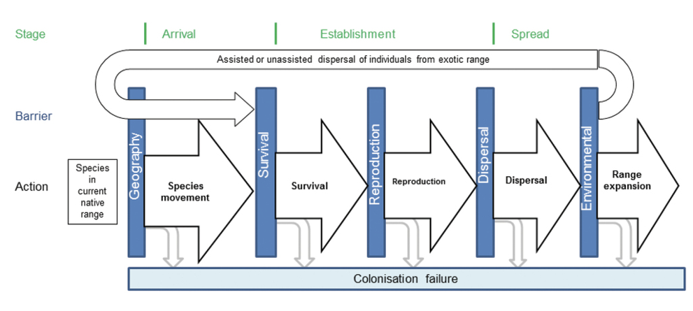
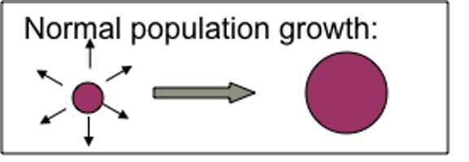
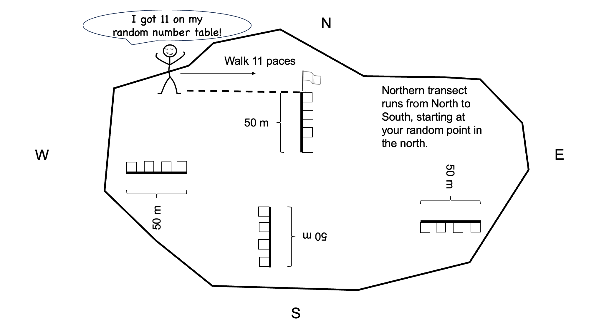
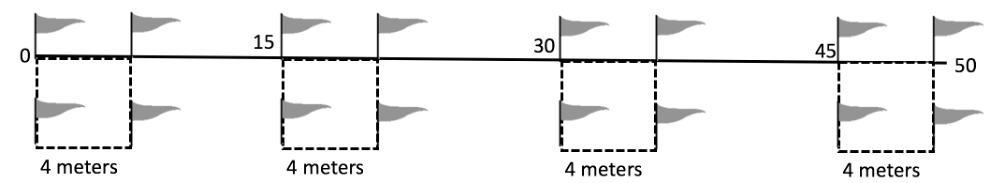

# Invasive species lab

## Introduction	

In this lab, you will consider the distribution of a non-native species that has become widespread in our region. You will collect field vegetation data according to common methods in ecology and answer discussion questions after your data collection.  

Biological invasions are considered one of the primary threats to biodiversity and ecological functions today. Any species that has been introduced by humans (either accidentally or on purpose) to a location it didn’t reach on its own is considered a non-native species. Other terms you might hear include exotic and alien. A non-native species that exerts a negative impact on native species is termed **invasive**. Not all non-native species become invasive: in fact, it is estimated that out of all species that are introduced, about 10% are able to establish reproducing populations in place, about 10% of those escape human-dominated areas and spread through natural areas, and about 10% of those become invasive. **Figure 1** illustrates the phases of invasion.

As non-native species establish and spread, their populations tend to follow predictable growth patterns. An initial group of individuals will reproduce and demonstrate population growth in the immediate area, slowly expanding the infestation as shown in **Figure 2**. Occasional long-distance dispersal events will establish new populations, each of which then demonstrates the same process and expands its occupied area.

Invasive species are known to exert a range of impacts, depending on the invading organism and on the characteristics of the invaded system. Worldwide, invasive species include vertebrates, invertebrates, and plants. Invasives have been known to outcompete native species, reducing native biodiversity in the invaded locale. Thick infestations of invasive plants, where no native plants are able to persist, are known as monocultures. Other invasives act as predators or herbivores, directly damaging or preying upon native species. Such effects have resulted in extinction (for example, predation by invasive cats and rodents has resulted in extinction of ground-nesting birds on islands). Other invasive species transform ecological conditions or functions: for example, invasions may alter soil pH or stability, water table accessibility, pollinator abundance, etc.

Agencies that manage forests and other natural areas must survey and monitor invasive plants within their jurisdictions. Monitoring information that is collected includes: total area infested, density or cover of the infestation, spread rate from year to year, environmental characteristics of inhabited sites. This information can help agencies predict further spread in the future. Other information that is often collected is focused on understanding the impacts of the invader, including the implications of the infestation for native species, soil characteristics, moisture availability, and ecological functions such as species interactions.

In this lab, we will look at where a non-native species of your choosing occurs, measure its density, and evaluate the presence of young individuals in order to develop some inferences about likely spread rates.

## Objectives

To characterize the current infestation of your nonnative focal species near a recreation site between NAU’s campus and a 4-lane interstate highway, and see how this infestation is driven by disturbance to the landscape. 

## Materials

Each group of 4 or 5 should have: 

1. 1 Tape measure (50m)
2. 1 meter tape (or meter stick)
3. 16 Pin-flags 
4. Printed lab with datasheets
5. Website for identifying invasives: https://nazinvasiveplants.org/

## Procedure

### Hypothesis development

In this lab, we will be characterizing a nonnative species infestation at our study site and 
exploring where it occurs. Specifically, we are interested in the question: **Does disturbance increase the abundance of nonnative species?**

Look around the site. Considering the site characteristics you can observe, brainstorm with your group and write a hypothesis for how you think environmental conditions are affecting the distribution of your nonnative focal species in the area. **Record your hypothesis** - you will need it for you lab packet!

Now, what evidence will you need to accept or reject your hypothesis. Write an if/then statement to guide your work, again recording for your lab packet. Several things to know when you are writing your if/then statement, we will be measuring non-native species density as your response variable. You will be recording both evidence of disturbance (i.e., roads, trash, etc.) as a direct measure of disturbance, and tree cover as an indicator of undisturbed habitat. 

### Nonnative species density quadrats

You will set your **quadrats** up along **transects**, or linear sampling features that you create with a tape measure or **transect tape**. Since you suspect that azimuth, or the direction, could influence nonnative species behavior, you decide to establish 4 transects, and place 4 quadrats along each transect. 

You divide the field into general directions. Azimuth is measured clockwise from 0° (which corresponds to true north) up to 360°.
-	0° or 360° = North
- 90° = East
- 180° = South
- 270° = West

At each end, use this random number sheet or the random number generator on your phone (you will need to choose smaller numbers) to identify a starting point for your transect. As an example, go to the northern part of the field, place your finger anywhere along the random number table. Use only the first two numbers of the 5 digit number. This will indicate the number of paces you will take along the northern end of the field. Then run the transect from the starting point south (north to south; see **Fig. 3**).  You can download the PDF by clicking [here](https://raw.githubusercontent.com/username/repository/main/downloads/example.pdf).

Extend the transect tape 50 meters to the south, in a line roughly parallel to the fence on the west 
side of the study site. You will sample four 4x4m quadrats along this 50m transect: one starting at 
0m, one starting at 15m, one starting at 30m, and one starting at 45m. 

At each survey point, place a pin-flag there to mark the corner. Continue 4m further down the transect tape and place another pin-flag. 
Use your meter stick/tape to measure 4m to the east of each of those pin-flags and place another 
pin-flag at each resulting point, creating a 4x4m quadrat. 

Within a quadrat, count the total number of your nonnative focal species plants and record that number. Record the total number of your nonnative focal species plants in the column 'NumberNonNativeSpecies' in this datasheet. [Download the CSV file](https://raw.githubusercontent.com/sarasouther/ENV226LabRManual/refs/heads/main/downloads/invasivespeciesdatasheet.csv) 

In addition, walk carefully throughout that 4x4m quadrat and look for evidence of disturbance (e.g., 
animal waste, trails, trash, scat, etc.). If there is disturbance in your plot, record 'Yes' if there is no disturbance record 'No' (be sure to capitalize) in this column, 'DisturbancePresent'. As evidence of more intact habitat (less disturbed), also record the number of trees (taller than the height of the tallest member of your group) that are shading the quadrat in the column, 'TreeNumber'. Repeat all of these methods until you have gathered data for all four 4x4m quadrats along all 4 transects (You will have collected data from 16 quadrats). 

### Analyses

Once you collect your data and enter it into your csv file, analyze your data. [Download the R file](https://raw.githubusercontent.com/sarasouther/ENV226LabRManual/refs/heads/main/downloads/InvasiveSpecies.R)

We are going to conduct a statistical test on your data using linear models. A linear model is a mathematical method used to describe the relationship between one or more predictor variables (also called independent variables) and a response variable (also called the dependent variable). When we fit a linear model, we want to know if the relationship between the predictor variables and the response variable is statistically significant. This helps us determine whether the predictors have a meaningful effect on the response, or whether the observed relationships could just be due to chance.

#### 1. Hypothesis Testing for Each Coefficient
For each predictor in the model, we test the following hypotheses:

- **Null Hypothesis (\( H_0 \))**: The coefficient is zero, meaning the predictor has no effect on the response variable.
- **Alternative Hypothesis (\( H_A \))**: The coefficient is not zero, meaning the predictor does have an effect on the response variable.

#### 2. P-value
The **p-value** tells us the probability of observing the data, assuming the null hypothesis is true. For each predictor:
- A **small p-value** (typically \( < 0.05 \)) suggests that the predictor has a significant effect on the response variable, and we reject the null hypothesis.
- A **large p-value** (typically \( > 0.05 \)) suggests that the predictor does not have a significant effect, and we fail to reject the null hypothesis.

#### 3. F-statistic (Overall Model Significance)
The **F-statistic** tests whether the model as a whole is better than a model with no predictors (a model that only includes the intercept). This tests the null hypothesis that all the coefficients (except the intercept) are zero:
- A **significant F-statistic** (p-value \( < 0.05 \)) suggests that the model explains a significant portion of the variation in the response variable.

#### 4. R-squared
The **R-squared** value tells us how much of the variation in the response variable is explained by the model. While this isn’t a test of significance, a higher \( R^2 \) value indicates that the model fits the data better.

#### 5. Reporting your results

A results statement has several important components:
1. A description of the statistical results with an appropriate citation on your results (test statistic, p-value).
2. If you have a *statistically significant* effect, a description of the magnitude and/or direction of the relationship, which often cites a figure. 

Here is an example of what your results statement should look like:
The position of the transect affect nonnative species density (F = 3.45, p = 0.02). Quadrats located on the southern side of the field had higher levels of invasion (Fig. 1).

## Assignment
When you are finished, report out on the primary research question that we addressed in lab: Does disturbance affect non-native plant density? 

In your brief report, provide:
1. Your hypothesis for the question
2. Your if/then statement describing the patterns that you expect to see in order to identify the information that you need to gather
3. A results statement for each statistical test
4. A figure with an appropriate legend
5. Interpretation of your results, answering the question: Does disturbance affect non-native plant density? Did you support or refute your hypothesis?

Put this in a document and turn into your TA!

