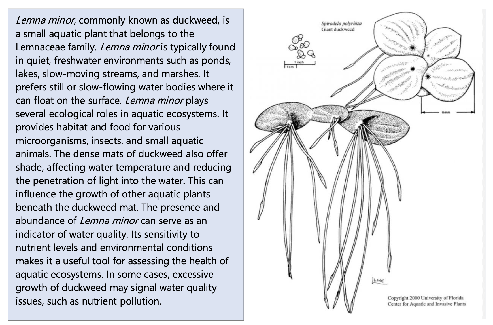
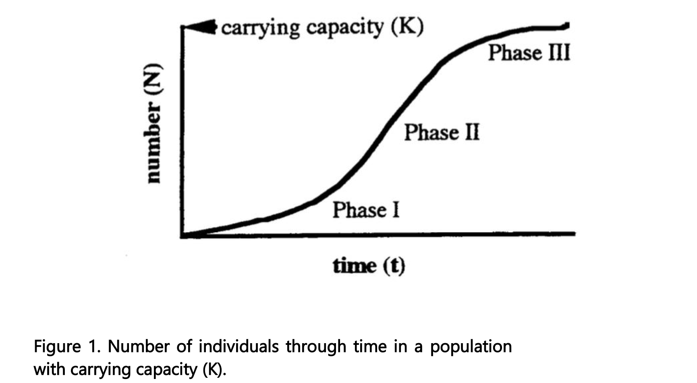

# Population ecology

> **Skills this lab builds.** *4DEE:* Core Ecological Concepts → Populations; Ecology Practices → Designing, conducting, and critiquing investigations; Quantitative reasoning and computational thinking. *BioSkills:* Process of Science → Study Design, Data Interpretation & Evaluation; Quantitative Reasoning → Numeracy; Science & Society → Ethics.

## Choosing a track

This lab runs in two versions. They use different organisms and **the same analysis**, because both produce the same thing: a count of individuals in a closed container, repeated over time.

| Track | Organism | What you count | Runs for | Main failure mode |
|---|---|---|---|---|
| **A. *Daphnia* microcosms** | *Daphnia magna* (water flea) | Individuals per jar | 3 weeks | Overfeeding |
| **B. Duckweed microcosms** | *Lemna minor* (duckweed) | Thalli per cup | 3 weeks | Low light; chlorine |

Your instructor will tell you which track you are running. Everything from **Final data collection and analysis** onward is identical for both.

### Downloads for this lab

- [Population growth datasheet (.csv)](downloads/population_growth_datasheet.csv)
- [R script for this lab](downloads/PopulationGrowth.R)

Both tracks use the same datasheet. Its three columns are:

```
Treatment,Day,PopulationSize
```

`Treatment` is whatever you are comparing — starting density, nutrient level, temperature. `Day` is days since setup. `PopulationSize` is your count. One row per container per counting day.

---

## Track A — *Daphnia* microcosms

*Daphnia magna* is a small freshwater crustacean, a few millimetres long, transparent enough that you can see its gut and its brood pouch with a hand lens. It is one of the most-used model organisms in aquatic ecology and ecotoxicology, and for this lab it has one decisive advantage over duckweed: it does not depend on light, so it does not care that it is February in Flagstaff.

It also gives you something duckweed cannot. A duckweed count is just a number. A *Daphnia* count can be split into **juveniles and adults**, so your population has visible age structure — and adults carrying eggs in the brood pouch tell you the population is still reproducing, before that shows up in the counts.

### Lab set-up (week 1)

**Objectives.** To measure population growth in a closed system, estimate *r*, λ and *K*, and interpret what happens when a population meets the edge of its resources.

**Materials**

1. Jars or beakers, 400–600 ml, clear
2. *Daphnia magna* starter culture
3. Dechlorinated water — tap water left standing at least 24 hours, or spring water
4. Baker's yeast or spirulina powder
5. Wide-mouth pipette or turkey baster
6. Petri dish and hand lens or dissecting scope
7. Labels and a marker
8. Datasheet and clipboard

> **Chlorine kills *Daphnia*, quickly and completely.** If your culture is dead at the first count rather than at the last one, chlorine is almost always why. Use water that has stood uncovered for 24 hours, or spring water. Never top a jar up straight from the tap.

**Procedure**

1. **Fill two jars** with 400 ml of dechlorinated water each. Mark the water line on the outside so you can top up to the same volume every week.

2. **Stock them at two densities.** Using the wide-mouth pipette, transfer **5 individuals** into the first jar and **25 individuals** into the second. Move animals gently and keep them submerged — a *Daphnia* dropped through air often does not recover.

3. **Count Day 0.** Pour the contents of one jar into a shallow petri dish, count every individual under the hand lens, and pour it back. Do this for both jars. Record the counts in the `Day 0` rows of your datasheet.

4. **Record juveniles and adults separately in your field notes.** Juveniles are noticeably smaller and have no brood pouch. You will not put this in the CSV, but you will want it in your discussion.

5. **Feed lightly.** A few grains of yeast, or a pinch of spirulina stirred into a little water and added by drops. The water should go **faintly cloudy, not milky**.

6. **Place the jars** somewhere at room temperature (18–22 °C) and out of direct sun. Direct sun will cook them.

> **The one thing that kills a *Daphnia* culture is overfeeding.** Excess food does not feed more *Daphnia* — it feeds bacteria, the bacterial bloom strips the dissolved oxygen out of the water, and the whole jar crashes. If the water is milky, you fed too much. Feed less, not more.

### Maintaining your microcosms (week 2)

1. Top each jar back up to the marked line with dechlorinated water.
2. Feed lightly, two or three times over the week.
3. Count both jars on Day 7 exactly as you did on Day 0, and record the counts.
4. Note in your field notes roughly what fraction of adults are carrying eggs.

### Final counts (week 3)

Count both jars on Day 14 and record. Then go to **Final data collection and analysis**.

### Ethics and disposal

*Daphnia* are invertebrates, so no animal-use protocol is required — that oversight covers vertebrates. Your instructor confirms this with NAU research compliance rather than assuming it, because institutions are allowed to set stricter internal rules than the federal minimum.

That said, "no protocol required" is not the same as "no obligations." Two apply here:

**Do not release live cultures.** Not down the drain, not into a pond, not into the wash. *Daphnia magna* is not native everywhere it is sold, and a lab organism released into a local water body is a lab organism you have introduced. At the end of the lab, freeze the cultures overnight or add a small amount of bleach before pouring them out.

**Say why you did it.** Being able to explain the reasoning behind a disposal decision — not just follow the instruction — is the actual skill. You will do the same thing in the diversity lab, where soil invertebrates are collected into isopropyl alcohol.

---

## Track B — Duckweed microcosms

### Lab set-up (week 1)

In a few weeks, we will complete a lab on the population dynamics of duckweed (*Lemna minor*) in microcosms. Today, we will set up your experiment. Next week, you will collect data on your populations and maintain your experiment.

### Objectives
To investigate population dynamics of duckweed using microcosms.

### Materials
1.	Microcosms (i.e., clear plastic containers)
2.	*Lemna minor* individuals
3.	Water
4.	Small labels or markers
5.	Light source (natural sunlight or artificial light)
6.	Data recording sheets

First, we will explore growth rates of populations with two different initial population sizes. Working in groups of 3 – 5, follow the procedure below. Then, proceed to setting up your experiment in which nutrient levels are varied!

### Procedure
1.	Fill two microcosms with artificial pond water, 200 ml. Mark the 200 ml water level on the cup so that you can refresh the culture solution to the same volume.
2.	Place two healthy Lemna plants in one of the cups. Place 15 health Lemna plants in the second cup.
3.	Because a plant can consist of one or more thalli, it is necessary that you now count the number of thalli in each cup. One thallus is any leaf unit that is over 1.5 mm. Record these data in the Day 0 column of Table 1.
4.	Place the cups under fluorescent or near natural lights for a period of two weeks, check them periodically to refill the cups to the 200 ml line.
5.	Count the number of thalli in each cup on Day 7 and Day 14. These counts are already reflected in the datasheet for this lab, but you will need to record population size going forward

Here is some information on *L. minor* to assist you!


### Maintaining your microcosms and measuring population growth (week 2)

1.	Check the microcosms and refill the cups to the 200 ml line.
2.	Count the number of thalli in each cup on Day 7 and Day 14. Record these data in the population size column of your datasheet.

> **If your duckweed dies, when it died tells you why.** Dying in week one, before it grew at all, is almost always chlorine in the water or too little light. Dying in week three, after it grew and filled the cup, is not a failure at all — that is the population hitting carrying capacity, and it is the most interesting result you can get.

---

## Final data collection and analysis

Everything below applies to both tracks. Where it says "thalli," read "individuals" if you ran *Daphnia*.

In this lab, we will collect data from your microcosms and analyze your results. First, we will learn a little more about microcosm studies in ecology, your model organism, and some population ecology background.

### Microcosm studies of population dynamics

Microcosms in ecological sciences are small-scale experimental systems that replicate natural ecosystems. Researchers use microcosms to study ecological interactions, nutrient cycling, and other ecological processes in a controlled environment. Here we will use microcosms to examine population dynamics to gain insights into core concepts in population ecology, such as population growth and carrying capacity.

In class, we discussed how populations have the capacity to grow **exponentially**, but resource availability eventually limits population growth. Light, space, food and nutrients are all examples of resources that may be limited within ecosystems and constrain population growth. Here, we will explore population growth using a **model organism** — a species used in scientific research to represent a broader biological phenomenon, serving as a convenient and well-understood subject for studying fundamental biological processes.

Over the last few weeks, you have been establishing and maintaining microcosm experiments (the duckweed version is modified from *Population growth: Experimental models using duckweed (Lemna spp.)*, University of Toronto, Toronto CANADA).

Few plants are suitable for studying continuous population growth because most plants have life cycles with discrete jumps in population size, their reproduction is seasonal and they respond to changes in population density by changing size and shape instead of population number (Harper, 1977). However, free-floating aquatic plants such as duckweeds (*Lemna* spp) or water ferns (*Azolla* and *Salvinia*) undergo continuous growth and therefore are excellent models for quantifying aspects of population growth (Clatworthy and Harper, 1962; Harper, 1977).

These plants are stemless and have only one to four leaf-like structures called thalli (singular = thallus), if they are flowering plants, or fronds, if they are ferns. Roots from the thallus hang free in the water. Duckweeds can reproduce by flowering and setting seed (sexual reproduction) but seldom do. More commonly they reproduce asexually by producing a new thallus or frond directly from an old one. When a new thallus has grown large enough and has roots, it breaks loose from its parent plant and grows on its own as a separate plant. The growth of a population can be followed by counting thalli or measuring changes in biomass (dry weight).

*Daphnia* solves the same problem a different way. It reproduces **parthenogenetically** under good conditions — females produce daughters from unfertilised eggs, with no males involved — so a small starter culture builds quickly and every individual you count is contributing to the next generation. That is what makes a handful of animals in a jar behave like a population rather than a collection.

If a pond or lab beaker is inoculated with one or two thalli and conditions are favorable, the plants commence exponential growth (Fig. 1, Phase I). The growth rate of the population under these conditions is density independent; the population grows unimpeded by resource limitation or competition. We can estimate the intrinsic rate of growth (r- see the equations on following pages) by measuring the uninhibited growth of low-density populations.

As thalli accumulate, the population becomes crowded and limited by the available resources. For a period, growth appears constant (Fig. 1, Phase II) as the width and thickness of the mat of floating plants increases. Eventually the beaker or pond fills with floating plants (Fig. 1, Phase III) and the population reaches a steady state (see the following equations). At this point, for every new thallus that appears, an existing one is shaded and dies, i.e., the population size is stable. The logistic growth curve (Fig. 1) illustrates all three Phases.



### Mortality is a measurement, not a failure

A closed microcosm is *supposed* to run out of room. That is the entire point of the logistic curve, and a population that grows and then levels off — or grows, overshoots and crashes — has given you a better dataset than one that grew smoothly for three weeks and stopped because the semester ended.

So resist the urge to call a declining count a broken experiment. Ask instead **when** it declined and **what ran out**. In a *Daphnia* jar, a crash in the last week is carrying capacity; a crash in the first week is chlorine or an oxygen collapse from overfeeding. The timing distinguishes them, and distinguishing them is the analysis.

### Population dynamics basics

Using your own or class data (if your experiment has failed), graph the average (mean) number of individuals (N) as a function of time for the low-density cultures and the high-density cultures.

The three equations shown below describe growth of populations:

**Exponential population growth** (expressed by the instantaneous rate of increase, r):
$$
\frac{dN}{dt} = rN
$$
where:
- \( N \) is the population size,
- \( r \) is the intrinsic growth rate, and
- \( t \) is time.

When we are looking over a discrete period of time, we can calculate **Geometric population growth rate**, described by the equation:

$$
N(t+1) = N(t) e^{rt}
$$
where:
- \( N(t) \) is the population size at time \( t \),
- \( r \) is the intrinsic growth rate, and
- \( t \) is time.
- \( e \) is the base of the natural logarithm (constant)

The factor by which a population increases in one unit of time (ert) is the finite growth rate of the population (λ), from:

$$ N(t+1) = N(t) e^{rt} $$
We take the natural logarithm of both sides:
$$
\log N(t) = \log N(0) + rt
$$
This equation now represents a linear relationship between \( \log N(t) \) and \( t \), where:
- The slope of the line is \( r \) (the intrinsic growth rate),
- The intercept is \( \log N(0) \) (the log of the initial population size).

By plotting \( \log N(t) \) vs. time \( t \), the slope of the line provides a direct estimate of \( r \).

When resources are finite, we can rearrange the exponential growth equation to include the carrying capacity of the environment.
The logistic growth model, which accounts for a population's carrying capacity, is described by the equation:

$$
\frac{dN}{dt} = rN\left(1 - \frac{N}{K}\right)
$$
where:
- \( N \) is the population size,
- \( r \) is the intrinsic growth rate,
- \( K \) is the carrying capacity, and
- \( \frac{dN}{dt} \) is the rate of change of the population over time.

**Estimating geometric growth**

Let's start by plotting population growth through time.

Since population growth rate is exponential, we can plot it as log (N) over time. Plot log N as a function of t for the low-density cultures. The slope of a line drawn through the mean log N at Day 0, Day 7, and Day 14 would approximate r. Make the same graph and calculations for the high-density cultures.

Now, let's calculate the finite rate of increase, \( \lambda \), using the equation:

$$
\lambda = \left( \frac{N_{t+1}}{N_t} \right)^{\frac{1}{t}}
$$
where:
- \( N_{t+1} \) is the population size at the final time point (e.g., Day 14),
- \( N_t \) is the population size at the initial time point (e.g., Day 0), and
- \( t \) is the total time (e.g., 14 days).

As the population in your container grows, the rate of growth will slow down. When the population reaches the carrying capacity of the container, the growth rate of the population will be 0 (dN/dt = 0). If you plot the geometric growth rate (λ, calculated above) for each container, as a function of population size (Nt), you should have a linear plot where the y intercept (where N = 0) would approximate r and when λ = 1, n = K. We derived that information by rearranging your formula for carrying capacity:

**Estimating \( r \)**:
- The intercept of the linear model (where \( N = 0 \)) is an approximation of the intrinsic growth rate \( r \).

**Estimating \( K \)**:
- The carrying capacity \( K \) is estimated by solving the equation where \( \lambda = 1 \) (i.e., when the population growth rate reaches zero):

$$
K = \frac{1 - \text{intercept}}{\text{slope}}
$$
**Plot your data. What is your estimated carrying capacity (K)?**

## Assignment

Please turn into your TA, your:

1. Estimates of r for both populations & associated figure
2. Estimates of finite population growth
3. Estimate of carrying capacity & associated figure
4. Summarize the findings and draw conclusions about the factors influencing population dynamics and discuss the implications of the study for understanding population ecology in natural ecosystems. Be sure to describe any differences in growth rates between the two microcosms and discuss why you might be seeing that pattern.

**If you ran Track A**, add one more:

5. What happened to the ratio of juveniles to adults over the three weeks, and what does that tell you about the population that the total count alone does not?

## Notes for TAs

- **Order the starter culture two weeks ahead, or collect locally.** Local collection from a Flagstaff-area pond is free and removes the non-native release question entirely — but confirm the collection is permitted for the water body you use.
- Total cost for the *Daphnia* track is under $50 for the whole course: $15–25 for a starter culture, a few dollars for yeast or spirulina, jars and hand lenses you already have. No compound scope is needed.
- **Watch for overfeeding in week 1.** It is the single most common way a section loses its cultures, and students overfeed because feeding feels like caring. Show them what "faintly cloudy" looks like on day one.
- Keep a spare culture running in the prep room. A group whose jar crashes in week one should be able to restart rather than sit out two weeks.
- The disposal step is a two-minute conversation, not a paragraph to skip. It is the only place in the manual that touches responsible conduct of research directly.
