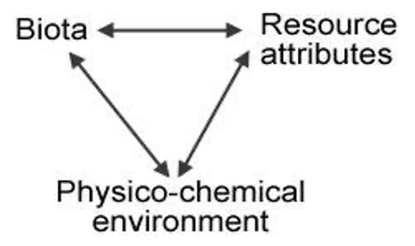
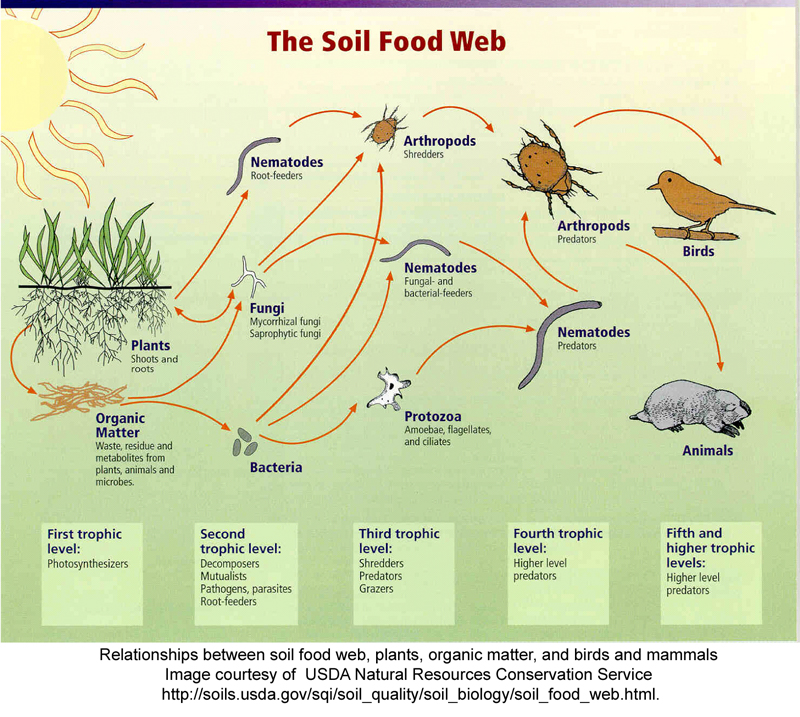

# Species diversity

## Introduction

Diversity and the measurement of diversity are central to many issues in ecological research as well as for applying ecology to real world problems. Every textbook in ecology devotes considerable description and explanation of species diversity, species richness, and species evenness. Community ecologists use measures of diversity to study and explain ecological patterns in many different types of communities.In terrestrial ecosystems, litter decomposition has important effects on processes such as nutrient cycling and community structure. Decomposition is affected by the type and quality of litter, climate, the edaphic conditions (including soil temperature, hydration, and chemistry), and the community of decomposer organisms (Swift et al. 1979).

**Figure 1.** Interactions among factors that control litter decomposition (from Swift et al. 1979).

This model shows the relationships among the three factors that govern litter decomposition rates: the Biota (structure and activity of the biotic soil food webs, i.e., microbes, invertebrates, vertebrates), the Physico-chemical environment (climate, habitat, edaphic factors, i.e., contributions from the non-living environment); and Resource Attributes (primarily plant species diversity and tissue chemistry, i.e., contributions from the living environment). 

Many studies have shown how both the living and the non-living environments affect soil community structure and diversity (Swift et al. 1979, Elliott et al. 1980, Ingham et al. 1982, Freckman & Virginia 1997). For example, decomposition of plant litter that is high in lignin and/or low in nutrients and is therefore difficult to decompose (resource quality) leads to dominance by fungal-feeding groups in the soil food web (namely, some taxa of nematodes, mites and Collembola), whereas easily broken-down litter is decomposed primarily by bacteria, which is reflected higher up the food chain (Coleman & Crossley 1996). And soil community diversity is at least partially determined by plant community diversity (Siemann et al. 1998). So in this case, the living environment is determining the soil community. 

On the other hand, recent work suggests that composition and biodiversity of soil organisms itself may have a greater effect on decomposition than has been previously recognized (González and Seastedt 2001, Wardle and Lavelle 1997, Wardle et al., 2003), especially in tropical ecosystems. So in this case, the soil biota is the driving force of the Physico-chemical environment and therefore the Resource Attributes in the Swift et al. (1979) model above. On yet a third hand, the soil Biota can directly affect the Resource Attributes. De Deyn et al. (2003) showed that soil fauna enhanced succession and diversity in a grassland community.

**Soil invertebrates play important roles in soil communities.** Some directly consume **detritus**, others consume **detritivores**, whereas others are higher-level **carnivores** that can indirectly control decomposition by their effects on lower levels of the food web (see Soil Food Web figure on the next page). The classic study of detrital food webs was conducted by Gist and Crossley (1975), showing which invertebrate groups are detritivores and which are carnivorous. Smith and Smith (2001) has a good description of the major findings of that study.  

Soil invertebrates are clearly affecting litter decomposition rates, soil aeration, nutrient mineralization, primary production, and other ecosystem services related to soil ecosystem function and agroecological conservation (e.g., Six et al. 2002). With interest in global climate change has come the realization that soil biota may strongly affect soil CO2 sequestration and release, which is a critical variable in climate change models. Agroscientists and restoration ecologists have found that soil biota play critical roles in toxic chemical and metal mobility and remediation; they directly affect disturbed ecosystem recovery/ ecological restorations that occur after fire, UV-B exposure, post-urbanization, and herbicide-stressed soils (e.g., Lal 2002). Bioprospectors carry out the search for novel antibiotics and other drugs among the billions of soil microorganisms. 

Soil invertebrates are also recognized for their role in mediating or determining belowground interactions among plants. Because they are often prey for vertebrates such as birds and mammals, they have vital roles in the food chains that include those animals. Take notes on the compost process from the videos linked to below. You will be able to reference this video in your lab report when discussing the methods for making compost. You will be turning this in, along with photos of the experimental set-up.

[Watch video 1 on YouTube](https://youtu.be/uAMniWJm2vo)
[Watch video 2 on YouTube](https://www.youtube.com/watch?v=QBSGuUq2D9E)
[Watch video 3 on YouTube](https://youtu.be/5XRoAZBdKaU)
[How to compost](https://youtu.be/nxTzuasQLFo)

## Week 1

## Downloads for this lab

[Directions to the compost area](https://docs.google.com/document/d/1tPXp0FvchBA4hqernEQKmI8_eDEMTka9/export?format=docx)

## Objectives 

Determine whether arthropod diversity varies with the depth of compost.
**Research Question**: How does soil arthropod diversity vary with depth of compost?

Record your hypothesis to the research question, along with how you will know if you hypothesis has been proven correct (if/then statement). You will turn this into your TA! 

## Methods

**Study Site(s)**: The class will be measuring soil invertebrate diversity in samples collected from the NAU campus compost facility. 

1. Collect soil from the NAU campus compost facility. Working together, be sure to collect soil from different depths (surface, deep) within the pile and be sure to track at which depth the soil was collected. If weather is inclimate, your TA may have collected soil for you.

2. Working in groups of 2-3, prepare your funnels: Remove a PVC pipe container. Cut a section of cheesecloth (two layers thick), and attach it tightly to the narrower end of the PVC pipe with rubber bands. Use masking tape to label the container with your compost age, lab section number and group member initials.
 
3. Scoop compost into the PVC pipe container until it is approximately half full. Make sure there are no solid clumps of compost in the container; you may need to gently break apart any clumps. Place the container into its place above the funnel and below a lightbulb.
 
4. Pour approximately 1 inch of half water, half 90% isopropyl alcohol into a 20-mL vial (3/4 full). Label the funnel with the same information as the PVC pipe. Place the vial beneath the funnel.
 
5. Screw in the light bulb above your funnel to turn it on. This is a behavioral extraction technique: many soil invertebrates will move away from light, and these organisms will end up falling through the funnel and into the alcohol. Your instructors will also monitor the liquid in each of the small vials throughout the week when you are not in lab. Moisture from the extractors may condense in those vials and increase the depth of their liquid, while diluting the alcohol.

When you return to lab next week, you will examine the contents of the 20-mL vials to observe the organisms that have been collected, and identify them using keys. You will then perform data analysis, calculating diversity metrics.  

## Turn-in week 1

Please turn-in:

- Notes from the video of the compost process
- Your hypothesis and if/then statement
- A photo of the Tullgren / Burlese funnel set-up

## Week 2

## Downloads for this lab

Please download this information:

- [Data sheets for recording arthropod diversity](https://docs.google.com/document/d/17EEEAznHCsfMOvyqD2xU2wx9W7enbTth/export?format=docx)
- [Taxonomic key for arthropod identification](https://drive.google.com/uc?export=download&id=15L5cU5sXxGj-w83Hm0Tfgavl9iRG-vUO)
- [Excel files to calculate diversity](https://docs.google.com/spreadsheets/d/1MbHuYrZbnnisuUqpPi8_IswaG8dORmrH/export?format=xlsx)
- [Reading on Shannon's Index](https://drive.google.com/uc?export=download&id=1ymTaRVXzTZHUAs1w6miGt-1Sdfbxv9LI)
- [Discussion questions](https://docs.google.com/document/d/1POS4xISzodRSV3urLwb2b_KMnCDd1Tmg/export?format=docx)

In this lab we will be analyzing the data from the compost arthropod lab to determine values for  species richness, evenness, and diversity. We will compare two metrics of soil invertebrate  biodiversity: 
We will be using the Shannon’s index (H´) to calculate species diversity. This is one of the  most common measures of species diversity in ecology, though there are others. Shannon’s  index takes into account both richness (the number of species) and evenness, or how evenly  individuals are distributed among species. A large value of H´ denotes high biodiversity.  Shannon’s index is advantageous over simply counting the total number of different species,  because a simple count is affected by sampling effort (plot size and total number of individuals sampled): the larger the sample, the more rare species you find. H´ is superior because it is  calculated from proportions (%), as you will see, and rare species contribute very little. Therefore, this index is relatively insensitive to the random inclusion or omission of rare species  that happens with any sampling effort. See the background information on Shannon's index for more information.

## Objectives 

Identify arthropods and calculate diversity of compost collected from two different depths.

## Methods

You will be identifying invertebrates (Arthropods) from the compost using dissecting  microscopes and dichotomous keys. Use the dichotomous key provided to make your best  guess at the taxon for each organism in your sample. Record abundances in each sample using  the table below.

## Turn-in week 2

Please turn in your discussion questions.

## Acknowledgements

Material in this lab is based mainly on: Boyce, Richard L. 2005. Life under your feet: measuring soil invertebrate diversity.http://tiee.esa.org/vol/v3/experiments/soil/abstract.html. 

