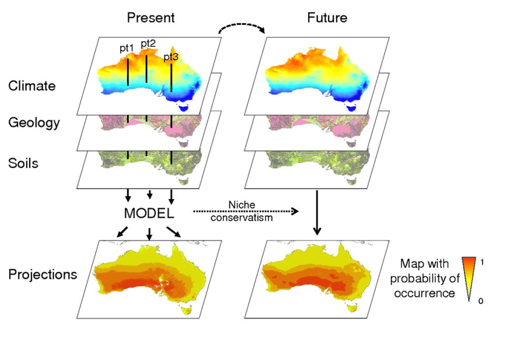
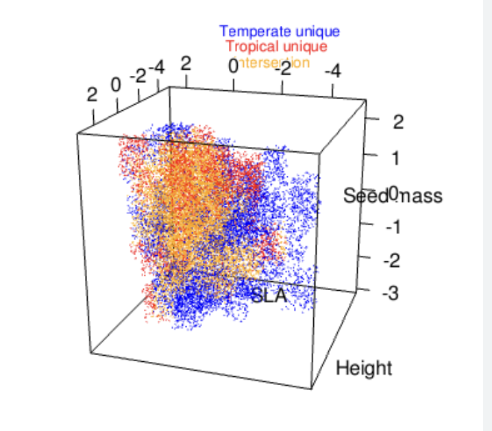
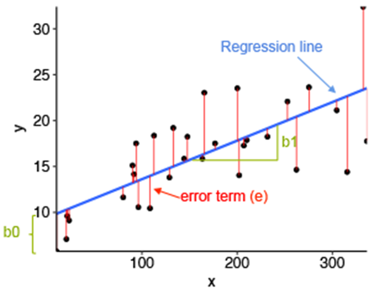
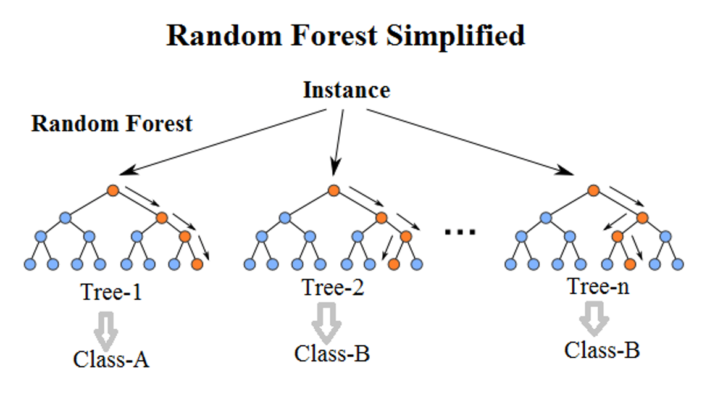
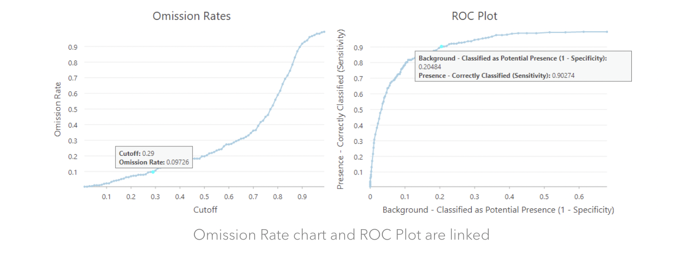

# Species Distribution Modeling

## Introduction 

Species distribution models (a.k.a.; ecological niche models, habitat models) relate environmental predictors like climate, elevation, or soil characteristics to species presence or abundance. These relationships are used to project likelihood of occurrence across space, by calculating the likelihood of occurrence across the study area using values associated with raster maps of the environmental variables in the model (**Fig. 1**). Most SDMs are correlative models that mathematically describe observed patterns of occurrence, and that do not incorporate underlying mechanisms in model projections. Understanding the limitations of correlative models (discussed below) is important for deciding when to use these models *and* interpreting your results. 

 
**Figure 1**. Raster layers are stacked to predict likely habitat.

## A brief review of niche theory

In spatial and population ecology, we define a species' niche as all the conditions under which populations of a species maintain growth rates that are at or exceed replacement rates. The niche is often defined in n dimensional space, since so many factors contribute to the performance of a species (**Fig. 2**). In ecology, there tends to be a lot of confusion about spatial niche concepts, since ecology students often first learn about species niches from an evolutionary standpoint. In evolutionary ecology, a species' niche is defined by a suite of traits possessed by an organism related to how this species 'makes its living' (attains food, nutrients, water). However, niche concepts and definitions are inherently related, and broadly describe the role of species within ecosystems.

 
**Figure 2**. Species niches are complex. In theory, we could describe the niche of a species by adding N number of axes and create a cloud representing all the habitats where a species could persist.

Ecologists break a species niche into two components: the **fundamental niche** and the **realized niche**. The fundamental niche is similar to the Grinnellian niche concept (*Introduced by Joseph Grinnell in is 1917 paper, The niche relationships of the California Thrasher*) niche concept. The **fundamental niche** of the species describes all the abiotic conditions that a species can physiologically tolerate and maintain population growth at or above replacement rates (we don't count areas where species persist, but are not maintaining themselves; these area are known as demographic sinks). The **realized niche** refers to all of the areas that we actually observe a species on the landscape. The concept emerged out of the work of Elton, who highlighted the importance of species interactions in defining species distributions. The **realized niche**, therefore, reflects the combined effects of the abiotic and biotic environment on persistence across the landscape. 

Typically, the **fundamental niche** is larger than the **realized niche**. In other words, a species can be found in a lot of places, but processes such as competition for resources or predation, reduce the total area occupied by a species. In some cases, the **realized niche** can be larger than the **fundamental niche**. This occurs when positive species interactions, like mutualisms or facilitation, allow a species to overcome some sort of environmental resistance and occupy sites that would be inhospitable for the species without 'help from a friend'. Finally, stochastic events, like disturbances, or landscape features, such as barriers to dispersal, can influence where as a species is found on the landscape.  

The distinction between **fundamental** and **realized** niches is important in order to understand the limitation of correlative SDMs, since these models cannot distinguish between the fundamental and realized niche of a species. Recall that species distribution models relate environmental factors to current occupation of a species. In most cases, habitat suitability is predicted using abiotic factors, including climate, soils, topographic information; all of which essentially describe the fundamental niche of a species (i.e., physiological tolerance to abiotic characteristics). However, the data used to build these models quantifies the current occupation of a species on the landscape, or the realized niche.

**This presents several issues**: 

* While we can learn generally about the abiotic factors that affect a species range, it is not a perfect picture of these tolerances, since distribution is affected by a variety of factors not included in the model.
* When a species fundamental niche and realized niche are really different due to factors not included in the model, current habitat projects can be inaccurate. This is a common problem when modeling habitat suitability for wild-harvested species, since they are underrepresented in suitable habitat, because those habitats are targeted for harvest.
* Using these models to predict future suitability should be interpreted skeptically. Future habitat suitability predictions are strong working hypotheses for ecological investigations or management actions. We don't actually expect many species to track their bioclimatic niches, since many of the factors that influence a species range aren't directly measured when building SDMs. SDMs are particularly unreliable when factors that shape a species niche change as a function of climate change. For instance, species interactions shape species distributions, and since species respond idiosyncratically to climate change, represent a major source of uncertainty in model predictions. 

These caveats and limitations, particularly related to your data, should be included in the discussion of your results. All of that said, SDMs can provide us with a lot of information with relatively little effort, and are often the best hypothesis on which to base decisions.

## Downloads for this lab

Create a file on your desktop called 'speciesdistributionmodels' and place the following files within it:

- [R script for creating the SDM](https://drive.google.com/uc?export=download&id=1_SSBxFBS421iJyH-O1_PJQ5s8VqW09sT)
- [Occurrence data](https://drive.google.com/uc?export=download&id=1D3hIBXCDSnqTQPmx7ZFOMqHzZk01--JQ)
- [Worksheet to turn-in](https://docs.google.com/document/d/1Od_MirdwRFjmDnCzo2TKwc5KxBFUbkPD/export?format=docx)

## Objectives

Project the effects of climate change on *Pinus ponderosa* in Arizona.

## Methods

### Let's get modeling

Now, let's walk through an example to discuss the various considerations and options for creating SDMs. For this exercise, we will use bioclimatic variables as environmental predictors. Bioclimatic variables are derived from downscaled climate models and created to be more more ecologically relevant compared to simple temperature and precipitation means. Bioclimatic variables are a great first step in model building, but depending on your study species and area, you may need to download finer scale layers or include other factors, like soil data. 

**Resolution**

Raster layers are spatially mapped grids comprised of hundreds, thousands, or millions of cells (aka pixels) with values related to a variable assigned to each pixel. The smaller the pixel, the higher the resolution, but this greatly affects processing speed and may exceed computer storage.

**Map projections**

Different methods are used to project the 3D earth into a 2D map. We have to specify the projection of the layers used in our models or our data layers will not align properly. In the example below, we will specify a coordinate reference system (CRS), which defines, with the help of coordinates, how the projected map relates to locations on the earth. 

**A CRS contains the following information**:

* Coordinate system: The X, Y grid that defines where a point is located in space.
* Horizontal and vertical units: The units used to define the grid along the x, y (and z) axis.
* Datum: A modeled version of the shape of the Earth which defines the origin used to place the coordinate system in space. You will learn this further below.
* Projection Information: The mathematical equation used to flatten objects that are on a round surface (e.g. the Earth) so you can view them on a flat surface (e.g. your computer screens or a paper map).

Luckily, we can pull all of this information from a spatial object, use the CRS function and reproject our data so that we are working with all data using the same CRS. Let's start by installing and loading the libraries that we will need for our analysis, and by importing both current climate and future climate projections. 

For this exercise, we will download bioclimatic variables to characterize current climate. Bioclimatic variables are variables derived from mean, maximum and minimum temperature and precipitation data summarized from weather station data from across the globe, then *interpolated* based on various landscape features, most importantly elevation, in order to assign climatic values to locations with no climate stations. These bioclimatic variables have been created in order to represent climate data in a way that is biologically-relevant. Specifically, these bioclimatic include:

* Annual Mean Temperature (bio1)
* Mean Diurnal Range (Mean of monthly (max temp - min temp); bio2)
* Isothermality (bio3),  Temperature Seasonality (standard deviation ×100; bio4)
* Max Temperature of Warmest Month (bio5)
* Min Temperature of Coldest Month (bio6)
* Temperature Annual Range (bio7)
* Mean Temperature of Wettest Quarter (bio8)
* Mean Temperature of Driest Quarter (bio9)
* Mean Temperature of Warmest Quarter (bio10)
* Mean Temperature of Coldest Quarter (bio11)
* Annual Precipitation (bio12)
* Precipitation of Wettest Month (bio13)
* Precipitation of Driest Month (bio14)
* Precipitation Seasonality (Coefficient of Variation; bio13)
* Precipitation of Wettest Quarter (bio16)
* Precipitation of Driest Quarter (bio17)
* Precipitation of Warmest Quarter (bio18)
* Precipitation of Coldest Quarter (bio19). 

Additionally, we will download climate projections. Climate projections are generated by Global Climate Models, which predict future climatic conditions based on complex algorithms describing the atmosphere. In order to project future species distributions, we need to select a particular climate model and a time period for which we are making predictions. Here, we are projecting suitable habitat for the time period 2061-2080. Since several facilities equipped with climate models generate climatic projections, we also have selected the CNRM-CM6-1 modeling group. 

Finally, we select the 'socio-economic pathway' utilized by our climate model. The degree of warming that occurs depends primarily on decisions that humans make around fossil fuel use and other climate mitigation strategies. The Intergovermental Panel on Climate Change (IPCC) works with social scientists, legislators and other to generate possible carbon use futures, which are then used to generate climate predictions. Here, we will use the Shared Socio-economic Pathway (SSP) '585'. Take a minute to search SSP 585.

Record the answers to these questions on your worksheet:

**Provide a description of SSP 585. How do countries respond to climate change in this scenario? What climate-related technologies are assumed to be used in this future?**  
\vspace{12pt}
\vspace{12pt}
\vspace{12pt}

**Is a low, middle-of-the-road, or high degree of warming predicted in this scenario? If you were to repeat this exercise, which SSP would you choose and why?** 
\vspace{12pt}
\vspace{12pt}
\vspace{12pt}

### Run the R code

Load your R file run and walk through the exercise.

Now that we've loaded our current and future climate models, let's input our occurrence data. For our data on species occurrence, we will use data from the Global Biodiversity Information Facility (GBIF), a repository for species observations and locations derived from multiple sources, including citizen science, herbarium and museum collections. The GBIF data are biased by observer behavior, since many observations are derived from citizen science projects. Humans tend to collect data from easily accessed areas around roads, popular hiking trails or congregating areas. One way to reduce bias in presence only data is to use spatial thinning to reduce weighting observations from heavily trafficked areas more than observations made in other areas. There is no standard thinning distance, but it is typical to require a minimum of 5 km between observations. If you are working at smaller or larger scales, you could reduce or increase this distance! Also, if you are using presence and absence data or have employed an unbiased sampling strategy to collect data, you can skip this next step. While there are various quality control measures used by GBIF to ensure high data quality, we will run a few other data cleaning codes to remove anomalous points. This step is not necessary if using nonGBIF data! However, when producing your own spatial datasets, some form of data quality control is necessary.

For this exercise, we will investigate whether models predict that Ponderosa pine forests that surround Flagstaff are predicted to persist as climate changes. Let's download occurrence data for Ponderosa pine (*Pinus ponderosa*).

Great! Now we have data! Let's build an SDM. Our first decision point on model construction is based on the response variable. In this case, we have presence-only data; in other words, no one went out to the field to confirm locations where a species is *absent* across the landscape. Since location information often suffers from *absence* of absence data (ha), researchers have found statistical workarounds, which produce amazingly similar results to models fitted with presence or absence data. The method most commonly used to model habitat suitability with presence-only data involves generated numerous background points across your study area to compare with areas where your species is present. Note that your focal species *could* occur at any one of these background points, but that doesn't matter. Essentially your model is characterizing habitat available to the species and the habitat of known occurrence to identify the environmental factors that best distinguish occupied habitat.

Let's breakdown the major model types used for SDMs:

**Profile techniques**

Profile techniques are simple algorithms that use environmental distance to known sites of occurrence to 'profile' habitat characteristics. These techniques are rarely used any more, so I won't discuss further! 
**Profile techniques include**:

* Mahalanobis distance
* Ecological niche factor analysis (ENFA)
* Isodar analysis
* Bioclim

**Regression-based approaches**

You are familiar with regression based approaches from other statistical analyses! All regression approaches build upon standard regression models (**Fig. 3**), but differ in subtle ways to address common challenges to data modeling, like issues of nonnormality or heterogeneity of variance. 

 

 **Figure 3**. Regression basics. Term y is related to term x. If the slope of the line differs significantly from 0, then there is a relationship between the variables. Error terms are derived from the residuals of the model; how much each individual point deviates from the line of best fit. The best fit is determined by repeatedly mapping lines across the data to identify that which most reduces error. 

**Regression-based techniques include**:

* Generalized Linear Modeling (GLM) (parametric)
* Flexible Discriminant Analysis (FDA) (parametric)
* Multivariate Adaptive Regression Splines (MARS) (nonparametric)
* Generalized Additive Modeling (GAM) (nonparametric)

* **Generalized Linear Models** are a flexible form of regression models. GLMs are 'generalized' by using a link function to relate the linear model to the response variable (which can be binomial, continuous, count data or other) and by relativizing the variance of each model term to its predicted value.

* **Generalized Additive Models** incorporate 'smoothing functions' to allow nonparametric estimates to be generated using a Bayesian approach. 

* **Multivariate Adaptive Regression Splines** automatically models data nonlinearities and interactions between variables.

* **Flexible Discriminant Analysis** uses optimal scoring to transform the response variable so that the data are in a better form for linear separation.
\vspace{12pt}

**Machine learning approaches**:
Machine learning techniques use training data to 'learn' about the dataset in order to make predictions.

**Machine learning approaches include**:

* Random Forest (RF)
* Boosted Regression Trees (BRT)
* Maximum Entropy (MaxEnt)

There are other machine learning techniques, like Artificial Neural Networks (ANN), but the list above is most commonly used for distribution modeling!

**Random forest** and **boosted regression trees** are similar, in that they create different 'trees' by iteratively bifurcating the dataset using predictor factors and identifying the tree that best predicts species occurrence. 

 
**Figure 4**. An illustration of random forest tree construction.

**MaxEnt** models are a little different. According to the principle of maximum entropy, high entropy is when the probability distribution best represents the current state of knowledge about a system, in the context of precisely stated prior data. These models evaluate the set of all trial probability distributions that would encode the prior data and select the distribution with maximal information entropy. 

#### Model selection

The world of species distribution modeling is a contentious one! Many leaders in the field have their own 'pet' models that invariably they helped to develop software or methodology for! The general consensus is that each of the different modeling techniques has various strengths and weaknesses, and they should be combined into ensemble models for habitat predictions. However, other approaches exist. One line of thinking in distribution modeling is to use solely GLMs, spending great care to identify critical predictor variables in a way that is tied to current ecological understanding and that reduces nonlinearities among these variables. By taking these steps, models are created, which in theory, should provide better inferential power for both current and future habitats. For presence only data, maximum entropy models are generally considered an excellent model choice. In my experience, there is no perfect model, rather model accuracy varies from species to species. For this reason, I typically build ensemble models to integrate the strengths of different model types.

#### Build an SDM

**Deal with environmental predictor colinearity**

In general, it is recommended to avoid having correlated features (variables that have different numbers, but are following the same pattern) in your dataset. Indeed, a group of highly correlated features will not bring additional information to our analyses, but will increase the complexity of the algorithm, thus increasing the risk of errors. Including highly correlated variables in models also, in essence, weights the correlated variables more than independent variables, again leading to less accurate model outputs. In other words, we need to remove highly correlated variables. We will do this by generating Variable Inflation Factor (VIF) values, a measure of collinearity, for all predictor variables. Then, we will remove one of the two correlated variables.

**Build the dataframe for the SDM**
Building the SDM, requires two additional steps. In the first, we assemble the final dataset to be used in the model. 

**Using the sdmData function, we indicate the following**:

* The column that contains presence data. 
* The environmental predictors. 
* Absence data or how to create background data.

**Specify model evaluation parameters**

When we build the final model using the SDM function, we specify **replication**. **Replication** is the method used to partition the dataset into training and test data. Ideally, we would have collected completely independent training and test datasets; however, I've never actually seen this done, except for researchers who are investigating SDM methods. Ninety nine point nine percent of the time, datasets are split into test and training datasets. As the names imply, training data are used to build the model, and then test data are used to measure how good our predictions are by quantifying how often our model correctly predicts presence or absence. Splitting or partitioning data into test and training datasets is often conducted several times, since outcomes may depend on the test or training data used to build and evaluate models. 

There are several methods to create training and test datasets. The three available in the package that we will use are subsampling (sub), crossvalidation (cv), bootstrapping (boot). For sub and boot, you must indicate what proportion of test and training data. A 30% test data, 70% training data split is common (test.percent=30). Finally, you will also the models how many times to repeat evaluations using the n equals code. This can eat up a lot of memory, so I typically use an n of 5.  

**Choosing the evaluation model**

**Crossvalidation** involves partitioning a sample of data into complementary subsets, performing the analysis on one subset (called the training set), and validating the analysis on the other subset (called the validation set or testing set). To reduce variability, in most methods, multiple rounds of crossvalidation are performed using different partitions, and the validation results are combined (e.g. averaged) over the rounds to give an estimate of the model's predictive performance. Crossvalidation does not rely on random sampling, but rather splits the dataset into k unique subsets. This is the preferred method for spatial model evaluation and estimating generalization capability. Note that you have to select the number of 'folds' or data partitions, which is typically set at 5. 

**Bootstrapping** iteratively creates separate datasets from randomly sampling with replacement. Bootstrapping it is not as strong as crossvalidation when it is used for model validation, since it contains repeated elements in every subset. Bootstrapping is typically repeated 30 times in SDM model evaluation!

**Subsampling** randomly splits the dataset into training and test datasets, but doesn't maintain the independence of the datasets. In other words, due to random sampling, you might wind up with similar training and test datasets in each trial. For this reason, the more structured crossvalidation method is typically preferred.

**Build the SDM**
Once the data is appropriately compiled, we use the sdm function to build the actual model. **Within this function, we specify**:

* The column that contains presence or presence or absence
* The dataframe that we are using (d1)
* The types of models that we are using
* Replication type (cv), number of folds (5), how many times to repeat partitioning (1)

THIS STEP WILL TAKE SOME TIME - JUST LET THE PROGRAM RUN!

The model object (m1) tells you several things. First, it gives a brief summary of the model you ran. You can double check this to be sure that the model did what you told it to do. Here, everything seems fine: We ran a model for one species, we used two modeling methods, glm and maxent, we used cross_validation with 5 partitions. The model runs were successful (100% each). Finally, we are provided with 4 measures of model performance: AUC, COR, TSS, and Deviance. 

**What types of models are we using to predict habitat suitability for Ponderosa pines (i.e., machine learning, regression, profile techniques)?**
\vspace{12pt}
\vspace{12pt}
\vspace{12pt}

#### Model evaluation explained

**AUC** stands for Area Under the Curve. AUC refers to a ROC plot, which plots sensitivity over 1 minus specificity. An ROC curve (receiver operating characteristic curve) is a graph showing the performance of a classification model at all classification thresholds. **AUC is desirable for SDM model evaluation for two main reasons**:

* AUC is scale invariant. 
* AUC is classification threshold invariant. It measures the quality of the model's predictions irrespective of what classification threshold is chosen. 

**This curve plots two parameters**:

* True Positive Rate (Sensitivity): the proportion of presences correctly predicted as presence,
* False Positive Rate (1 minus Specificity): The specificity denotes the proportion of absences that are correctly predicted as absence, so the false positive rate indicates how many times the model predicted an occurrence when there was none. 

**AUC ranges in value from 0 to 1. A model whose predictions are 100% wrong has an AUC of 0.0; one whose predictions are 100% correct has an AUC of 1.0. As a rule, an AUC > 0.75 indicates a high performing model.**

SDMs predict a probability of occurrence across the landscape. Different thresholds can be used to create a cutoff to predict presences or absences. For instance, we could say that if there is a 90% chance or more that a pixel is suitable habitat, then we consider those areas as occupied. We want to identify a cutoff that maximizes true presences, while minimizes false positives (i.e., areas that you incorrectly say contain a population, but don't). You can see that as you decrease the cutoff, from say 90% to 70%, then your likelihood of correctly predicting presences goes up, BUT so does your likelihood of false positives. 

So, let's check out the ROC plot below. 

**Looking at AUC, a common form of model performance assessment, which is the best performing model?**
\vspace{12pt}
\vspace{12pt}
\vspace{12pt}

Generally, there is strong agreement between the test and the training data. As you increase the cutoff threshold, the likelihood that you correctly assign presence goes up, but so does the false positive rate (**Fig. 5**). Note that on the far right hand side of each ROC plot, if the cutoff is high enough, you will have a 100% true positive rate, and a 100% false positive rate (the cutoff is so low, that all habitats are predicted to support the focal species). Alternatively, with a low enough cutoff (left hand side of the ROC plot), you won't have any positives or any false positives! This AUC cutoff will be important for building ensemble models; explained below! 

 

**Figure 5** This figure (lifted from an ARCGIS website) shows the relationship between omission rates and ROC plots. So if we want an Omission Rate that is slightly less than 10%, we can use 0.29 as the Cutoff instead, and in this case, we will pick up 20.48% background points as potential presence locations, which is also a good rate.

Like AUC, **True Skill Statistic (TSS)** values are calculated across the range of possible thresholds for classifying model scores.The TSS similarly incorporates sensitivity and specificity comparing models against random, yielding values that range from negative 1 to positive 1, where positive 1 indicates perfect prediction and greater than or equal to 0 indicates a model that performs no better than random. TSS is typically considered a better indicator of model performance for presence only models. **A TSS of 0.5 or higher indicates high model performance.**

**Pearson correlation (COR)** between the predicted likelihood of presence and the presence or absence testing data. 
**Deviance** Lastly, if a model is interpreted as estimating species’ probability of presence, rather than just giving an index of habitat suitability, then the model predictions can be evaluated using deviance, defined as 2 times the log probability of the test data.

#### Ensemble model assembly

Finally, we will merge models into an ensemble model. You may want to exclude models that didn't have high predictive performance. We will give higher weights to the models with higher accuracy, in this cause using the TSS score. 

#### Investigating model components

We can run code to look at the model components that best predict presence.

**According this figure, which climatic variable best predicts habitat suitability for Ponderosa pine?**
\vspace{12pt}
\vspace{12pt}
\vspace{12pt}

#### Convert to presence or absense predictions

We use the test statistics to identify a threshold that maximized true positives and reduced false negatives. In order to do this, we will create a new raster and populate it with predictions of presence, using that threshold.

####  Plotting and predictions

Let's take a quick look at the predictions we have created for the current time period. 

To predict response of your focal species to future climate, just plug the novel climate conditions into the model!
Let's run this model.

Now, let's plot this prediction against our original! First, we'll take a zoomed out look, then we will focus into our region!

Let's convert to predicted occurrence and plot!

**According to these maps, how will the amount of suitable habitat for *Pinus ponderosa* in Flagstaff change if climate change continues along the SSP 585 projection?**
\vspace{12pt}
\vspace{12pt}
\vspace{12pt}

**How certain are you of these projections? Why might these models NOT be accurate?**
\vspace{12pt}
\vspace{12pt}
\vspace{12pt}

**What type of vegetation do you think might be more common around Flagstaff as climate changes?**
\vspace{12pt}
\vspace{12pt}
\vspace{12pt}

Submit your answers to the questions presented throughout this tutorial and the figures that you generated (Occurrence of *Pinus ponderosa* currently and in the future) to your TA.